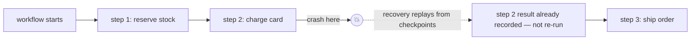
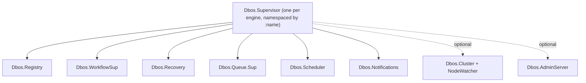

# Dbos

A durable execution engine for Elixir, ported from [DBOS Transact](https://github.com/dbos-inc/dbos-transact-golang).

## The problem

A normal function call is gone the moment the process crashes. `Dbos` makes a function call
**durable**: every step it takes is checkpointed in your existing Postgres database, so a crash,
a deploy, or a killed node resumes exactly where it left off — no queue infrastructure, no
second database, no separate worker fleet.



## What lives where

| Piece | What it gives you |
|---|---|
| Workflows, steps, transactions | `defworkflow`/`defstep`/`deftransaction` — durable functions |
| Queues | Concurrency limits, rate limits, priority, partitioning, delayed/debounced enqueue |
| Recovery | Crash/restart resumes from the last checkpoint, on this node or another |
| Scheduler | Cron-driven workflows, backed by the database, no separate scheduler process elsewhere |
| Admin server | An HTTP API to inspect, cancel, resume, and fork running workflows |
| Telemetry | `:telemetry` spans for workflow/step/queue/recovery events — see `docs/telemetry.md` |

## Quickstart

Add the dependency:

```elixir
def deps do
  [{:dbos, "~> 0.1.0"}]
end
```

Write a workflow:

```elixir
defmodule MyApp.Checkout do
  use Dbos, repo: MyApp.Repo

  defworkflow process_order(order_id, amount), name: "process_order" do
    charge = charge_card(order_id, amount)
    record_receipt(order_id, charge)
  end

  defstep charge_card(order_id, amount) do
    PaymentGateway.charge!(order_id, amount)
  end

  deftransaction record_receipt(order_id, charge) do
    Ecto.Multi.new()
    |> Ecto.Multi.insert(:receipt, %Receipt{order_id: order_id, charge_id: charge.id})
    |> MyApp.Repo.transaction()
  end
end
```

Start the engine in your supervision tree:

```elixir
defmodule MyApp.Application do
  use Application

  def start(_type, _args) do
    children = [
      MyApp.Repo,
      {Dbos.Supervisor,
       name: Dbos,
       db: {Dbos.DB.Ecto, MyApp.Repo},
       workflows: [MyApp.Checkout],
       migrations: :create_if_absent}
    ]

    Supervisor.start_link(children, strategy: :one_for_one)
  end
end
```

Run your first durable workflow — a bare call to `process_order/2` is already durable:

```elixir
MyApp.Checkout.process_order("order-123", 4999)
```

Kill the BEAM mid-charge and restart: `process_order/2` resumes from whichever step last
checkpointed, without re-charging a card that already succeeded.

## Supervision tree



Multiple engines can run in one BEAM (each given a distinct `:name`) — every process above is
namespaced under it. See `Dbos.Supervisor`'s module docs for every option, and:

- `docs/clustering.md` — dead-node work reclaim, opt-in, built on `:pg`/`:net_kernel`.
- `docs/telemetry.md` — every emitted `:telemetry` span.
- `docs/testing.md` — how the two test suites (unit/acceptance vs. Docker-based node-kill) work.
- `docs/interop-migration.md` — what is and isn't readable by a non-Elixir process.

## The determinism contract, in one paragraph

A workflow body re-executes from the top after a crash; steps that already completed return
their recorded output instead of running again. This is only correct if the body takes the same
path and calls steps with the same arguments every time it replays — a workflow computing a step
argument from a live read of mutable state (the current time, a random number, a database row
that can change between runs) risks the step returning a **stale** recorded result on replay
instead of an error, because step arguments are never themselves persisted. `defworkflow` catches
the common mistakes at compile time. Full contract, worked example, and the banned-construct
table: `docs/determinism.md`.

## Testing

`mix test` runs the unit/acceptance suite against a local Postgres. `mix test.integration` runs
a Docker-based suite that kills a whole node and checks a second node recovers it. See
`docs/testing.md`.
