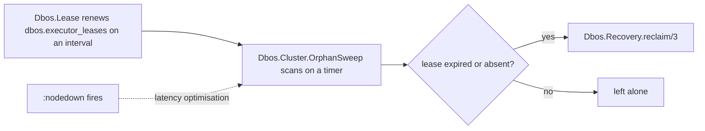

# Clustering: executor leases and dead-executor recovery

## Why a Postgres lease, not `monitor_nodes`

Every liveness detector is a guess; none can tell a dead node from a slow or partitioned one. The
choice that matters is not which detector is more accurate — it is whether the detector shares a
failure domain with the resource being contended.

| Detector | Failure domain | Failure mode on a false positive |
|---|---|---|
| `:net_kernel.monitor_nodes/1` | BEAM-to-BEAM | Says nothing about whether either node can still reach Postgres. Both nodes keep checkpointing. |
| A lease held in Postgres | The same connection an executor checkpoints through | A node that cannot renew also cannot write conflicting checkpoints. Self-limiting. |

So the lease is the sole authority for an automatic reclaim. `monitor_nodes` is demoted to a
latency optimisation: on `:nodedown` it triggers an immediate sweep pass, nothing more. The sweep
still requires an expired lease before reclaiming anything, so a BEAM netsplit — both sides see
the other as `:nodedown` while Postgres is reachable to both — degrades to waiting out the lease
TTL instead of both sides reclaiming (and double-executing) a node that is merely unreachable, not
dead.

## The three pieces



- **`Dbos.Lease`** — one per engine. Writes this executor's row in `dbos.executor_leases` at
  boot, before recovery runs, and renews it every `lease_renew_interval_ms`. A renewal failure is
  logged and retried next tick, not fatal. Graceful shutdown expires the lease immediately
  (`terminate/2`, best-effort — a `:brutal_kill` or a killed node never runs it), so a replacement
  executor doesn't wait out the TTL.
- **`Dbos.Cluster.OrphanSweep`** — on by default, independent of `:pg` and distributed Erlang
  entirely. Reclaims `PENDING` rows whose executor's lease has expired, or who never renewed one
  at all (the pre-upgrade case, and the steady state for any executor identity a lease was never
  written under). `updated_at` plays no part: a workflow legitimately parked for days in
  `Dbos.sleep/1` or `recv_message/2` says nothing about whether its executor is alive — that was
  the old signal, and it produced false reclaims of perfectly healthy, long-waiting workflows.
- **`Dbos.Cluster.NodeWatcher`** — `:net_kernel.monitor_nodes(true)`. On `:nodedown`, calls
  `Dbos.Cluster.OrphanSweep.sweep_now/1` in an unsupervised `Task`, purely to shave latency off
  the next scheduled sweep. Started only with `cluster: [enabled: true]`.

## Enabling it

```elixir
{Dbos.Supervisor,
 name: MyApp.Dbos,
 db: {Dbos.DB.Ecto, MyApp.Repo},
 lease: [ttl_ms: 60_000, renew_interval_ms: 10_000],
 orphan_sweep: [enabled: true, interval_ms: 300_000],
 cluster: [enabled: true, batch_size: 50]}
```

| Option | Default | What it controls |
|---|---|---|
| `lease.ttl_ms` | `60_000` | How long a lease stays valid without a renewal. |
| `lease.renew_interval_ms` | `10_000` | How often it renews — a small fraction of the TTL, so a couple of missed renewals are survivable. |
| `orphan_sweep.enabled` | `true` | The lease-expiry scan. On by default — no `cluster:` option needed. |
| `orphan_sweep.interval_ms` | `300_000` | How often the scan runs. |
| `cluster.enabled` | `false` | Joins a `:pg` group and triggers an immediate sweep on `:nodedown`. A latency optimisation only. |
| `cluster.batch_size` | `50` | Rows one reclaim pass claims. |
| `cluster.group` | `Dbos.Cluster.Group` | The shared `:pg` group name every engine that should see each other's roster must agree on. |

`orphan_sweep.enabled` defaults to `true` — a behavior change for any existing deployment that ran
with clustering off, since previously that meant no automatic reclaim at all. It is what fixes a
Kubernetes-style deployment that never enables `cluster:`: `DBOS__VMID` there is typically a pod
name that changes every deploy, so without a lease-driven sweep, every workflow the old pod held
stays stranded `PENDING` forever.

## Why no first-boot grace period

`Dbos.Lease` writes this executor's row synchronously in `init/1`, before `Dbos.Recovery` starts —
`Dbos.Supervisor`'s child list starts each child in order, blocking on `start_link/1` before
moving to the next. So the window between "this executor has `PENDING` rows under its own id" and
"this executor has a lease row" is, in practice, zero: nothing about this executor's own rows is
visible to a peer's sweep before the lease exists. A peer's sweep running concurrently during this
executor's first few milliseconds of boot could still see "no lease row yet" for a *stable*
identity (one that reused a previous, pre-upgrade executor id with existing `PENDING` rows) and
reclaim them to itself — but reclaiming to a live, healthy peer is a correct outcome, not a bug;
it just means that peer's recovery runs the workflow instead. No grace period was added.

## Capability-aware reclaim

A reclaim, automatic or operator-triggered, only ever reassigns rows whose workflow `name` this
engine has registered (`Dbos.Registry.registered_names/1`) — see
`docs/system-database.md`/`Dbos.Recovery`'s own docs for the query. A deployment is normally
heterogeneous: different nodes run different workflow modules, so seeing a name this engine
doesn't implement is routine. Reassigning it anyway would strand it permanently, since its new
owner's lease is healthy and no future sweep would ever move it again. An empty registry reclaims
nothing at all, rather than the filter being skipped.

## Manual reclaim stays unguarded

`Dbos.Recovery.reclaim/2,3` and the admin server's `POST /dbos-workflow-recovery` are an operator
explicitly asserting a node is dead. Neither consults a lease — an operator override must remain
possible even while a lease looks healthy (a node hung in a way that still renews its lease but
can no longer make progress, say). Only the automatic sweep path consults leases. Both paths are
still capability-aware: an operator cannot make this node run code it does not have, so those rows
are left for whichever peer does implement them.

No election, no advisory lock, either way:

```sql
UPDATE workflow_status
   SET executor_id = $this_executor
 WHERE workflow_uuid IN (
   SELECT workflow_uuid FROM workflow_status
    WHERE executor_id = ANY($dead_executor_ids) AND status = 'PENDING' AND queue_name IS NULL
      AND name = ANY($registered_names)
    ORDER BY created_at ASC
    LIMIT $batch_size
    FOR UPDATE SKIP LOCKED
 )
RETURNING ...
```

Every survivor may run this concurrently for the same dead ids — the `UPDATE` is the
serialization point, so a call that loses the race simply redispatches nothing. `FOR UPDATE SKIP
LOCKED` lets concurrent callers claim disjoint batches without blocking on each other. A queued
`PENDING` row is excluded and handled separately: it goes back to `ENQUEUED` with its queue
assignment cleared, so the queue redistributes it.

## What it costs

| Cost | Detail |
|---|---|
| One extra process per engine, always | `Dbos.Lease`. |
| One more, on by default | `Dbos.Cluster.OrphanSweep`. |
| Two more, only with `cluster.enabled` | `Dbos.Cluster`, `Dbos.Cluster.NodeWatcher`. |
| A renewal write per `lease.renew_interval_ms` | One `INSERT ... ON CONFLICT` per engine. |
| A poll per `orphan_sweep.interval_ms` | One query, engine-wide, independent of how many workflows exist. |
| A `:pg` group, only with `cluster.enabled` | Shared across every engine using the same `cluster.group`. |

## What a stale local timer cannot do

A workflow parked in `Dbos.sleep/1`/`recv_message/2` (`Dbos.Waits`) leaves an ETS entry and a
timer on its original executor, even after that executor's lease has expired and a peer has
reclaimed the row. When that stale timer fires, `Dbos.Waits`' redispatch only proceeds if the
row's `executor_id` still matches this engine's own — otherwise it is a no-op. Without this check,
the original node's timer would redispatch locally regardless of who now owns the row, running it
a second time concurrently with whichever peer reclaimed it.

## Partition risk

Under a network partition where both sides can still reach Postgres, only the side that keeps
renewing its lease is ever eligible for its own rows to be reclaimed by the other — and it isn't,
since a live lease makes a row immune. The failure mode a lease cannot close is a node that hangs
in a way that stops making progress but keeps renewing (a live connection with a wedged process,
say); `owner_xid` on `workflow_status` remains the safety net for exactly that case: a step
recorded by one side updates the row's owner, and a later checkpoint attempt from a different
executor sees an owner mismatch. It does not prevent a double execution; it only makes it
detectable once it happens.
