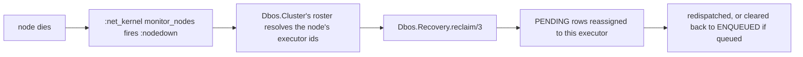

# Clustering: dead-executor recovery

The reference has no executor heartbeat and no liveness table. Deciding who is dead is normally
the job of the DBOS Conductor control plane, which this port does not have. On the BEAM, a node's
death is already visible to every other node for free — this feature closes that gap using only
built-in OTP: `:pg`, `:net_kernel`, no third-party clustering library.

Off by default. Enabling it costs a small `:pg` group and one extra process per engine; the
engine starts and runs identically with it off.

## Enabling it

```elixir
{Dbos.Supervisor,
 name: MyApp.Dbos,
 db: {Dbos.DB.Ecto, MyApp.Repo},
 cluster: [
   enabled: true,
   batch_size: 50,
   orphan_sweep: [enabled: true, interval_ms: 300_000, threshold_ms: 300_000]
 ]}
```

| Option | Default | What it controls |
|---|---|---|
| `cluster.enabled` | `false` | Joins the `:pg` group, watches for departed nodes, reclaims their work. |
| `cluster.batch_size` | `50` | Rows one reclaim pass claims. |
| `cluster.group` | `Dbos.Cluster.Group` | The shared `:pg` group name. Several engines sharing one group see each other's roster — this is what makes a node-to-executor-ids lookup many-to-one. |
| `cluster.orphan_sweep.enabled` | `false` | A further periodic scan, layered on top of `cluster.enabled`. |
| `cluster.orphan_sweep.interval_ms` | `300_000` | How often the scan runs. |
| `cluster.orphan_sweep.threshold_ms` | `300_000` | How stale a `PENDING` row must be before the scan treats its executor as gone. |

## What it does



Three pieces, all namespaced per engine:

- **`Dbos.Cluster`** — joins a `:pg` group and caches every `{node, executor_id}` pair it sees.
  Refreshes on every join. Degrades to a single-entry roster of just itself — logged once at
  `info` — when distributed Erlang isn't running or `:pg` can't be reached. Tests and single-node
  deployments always take this path.
- **`Dbos.Cluster.NodeWatcher`** — `:net_kernel.monitor_nodes(true)`. On `:nodedown`, resolves the
  departed node's executor ids and calls `Dbos.Recovery.reclaim/3` in an unsupervised `Task`, so a
  slow reclaim never blocks node-down handling.
- **`Dbos.Cluster.OrphanSweep`** — a periodic scan for `PENDING` rows whose executor is absent
  from the live roster and stale past the threshold. Covers what `:nodedown` cannot see: a
  whole-cluster restart, or a pod that is gone for good and never sent a disconnect.

Both paths call the same primitive, `Dbos.Recovery.reclaim/3`:

```sql
UPDATE workflow_status
   SET executor_id = $this_executor
 WHERE workflow_uuid IN (
   SELECT workflow_uuid FROM workflow_status
    WHERE executor_id = ANY($dead_executor_ids) AND status = 'PENDING' AND queue_name IS NULL
    ORDER BY created_at ASC
    LIMIT $batch_size
    FOR UPDATE SKIP LOCKED
 )
RETURNING ...
```

No election, no advisory lock. Every survivor may run this concurrently for the same dead ids —
the `UPDATE` is the serialization point, so a call that loses the race simply redispatches
nothing. `FOR UPDATE SKIP LOCKED` lets concurrent callers claim disjoint batches instead of
blocking on each other. A queued `PENDING` row is excluded and handled separately: it goes back to
`ENQUEUED` with its queue assignment cleared, so the queue redistributes it instead of this call
redispatching it directly.

## What it costs

| Cost | Detail |
|---|---|
| One extra process per engine | `Dbos.Cluster`; two more (`NodeWatcher`, `OrphanSweep`) if fully enabled. |
| One `:pg` group | Shared across every engine using the same `cluster.group`. |
| A remote call per new member | Resolving a joining pid's `{node, executor_id}` is one `GenServer.call/3` to that pid. |
| A poll, if the orphan sweep is on | One query per `orphan_sweep.interval_ms`, engine-wide, not per workflow. |

## Partition risk

Under a network partition, each side sees the other as dead. Both sides reclaim the same
`PENDING` rows independently, so a step body can run twice — once on each side, both live.

`owner_xid` on `workflow_status` detects this after the fact: a step recorded by one side updates
the row's owner, and any later checkpoint attempt from the other side sees an owner mismatch. It
does not prevent the double execution; it only makes it detectable once the partition heals.

A quorum-based design would trade this for refusing to recover any workflow during a partition —
its own outage, on the side that loses the quorum. This port takes the availability side of that
trade: reclaim always proceeds, and `owner_xid` is the safety net.
