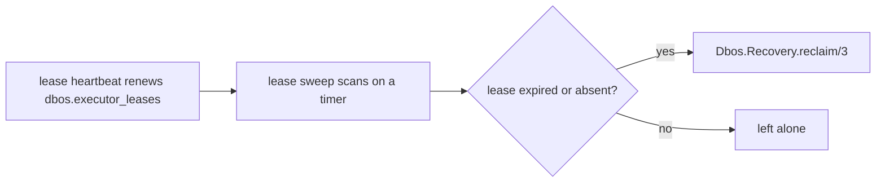

# Executor leases and dead-executor recovery

Run several engines against one system database and any of them can die mid-workflow. The
survivors need a rule for deciding when a `PENDING` row's owner is gone and its work may be picked
up. That rule is an **executor lease** held in Postgres.

## The lease is the authority

Each engine writes a row in `dbos.executor_leases` keyed on its `executor_id`, and renews it on an
interval over the same connection it checkpoints through. An executor that cannot renew its lease
also cannot write conflicting checkpoints, so acting on an expired lease is self-limiting.

A lease is the only signal an automatic reclaim consults. `updated_at` staleness plays no part: a
workflow parked for days in `Dbos.sleep/1` or `recv_message/2` says nothing about whether its
executor is alive.



| Piece | Role |
|---|---|
| Lease heartbeat | Writes this executor's lease at boot, before recovery runs, and renews it every `lease.renew_interval_ms`. Graceful shutdown expires the lease immediately, so a replacement does not wait out the TTL; a killed node's lease expires on its own. |
| Lease sweep | Scans every `lease_sweep.interval_ms` for `PENDING` rows whose executor's lease has expired or is absent, and reclaims them. |

Both need only the system database. Nothing here uses distributed Erlang, so a fleet of pods that
never see each other on the BEAM recovers exactly like a connected cluster.

Worst-case detection latency is `lease.ttl_ms + lease_sweep.interval_ms` — 90 seconds on the
defaults, 75 on average.

## Configuration

```elixir
{Dbos.Supervisor,
 name: MyApp.Dbos,
 db: {Dbos.DB.Ecto, MyApp.Repo},
 lease: [ttl_ms: 60_000, renew_interval_ms: 10_000],
 lease_sweep: [enabled: true, interval_ms: 30_000, batch_size: 50]}
```

| Option | Default | What it controls |
|---|---|---|
| `lease.ttl_ms` | `60_000` | How long a lease stays valid without a renewal. |
| `lease.renew_interval_ms` | `10_000` | How often it renews — keep it a small fraction of the TTL so a couple of missed renewals are survivable. |
| `lease_sweep.enabled` | `true` | The lease-expiry scan. |
| `lease_sweep.interval_ms` | `30_000` | How often the scan runs. |
| `lease_sweep.batch_size` | `50` | Rows one reclaim pass claims. |

`DBOS__VMID` in a Kubernetes-style deployment is typically a pod name that changes every deploy, so
the old pod's `PENDING` rows are recovered by the sweep once its lease lapses.

## Capability-aware reclaim

A reclaim only reassigns rows whose workflow `name` this engine has registered, and whose
`application_version` matches this engine's. A fleet is normally heterogeneous — different nodes
run different workflow modules — so encountering a name this engine does not implement is routine,
and taking it would strand the row permanently under a healthy lease. An engine with an empty
registry reclaims nothing.

## The reclaim query

```sql
UPDATE workflow_status
   SET executor_id = $this_executor
 WHERE workflow_uuid IN (
   SELECT workflow_uuid FROM workflow_status
    WHERE executor_id = ANY($dead_executor_ids) AND status = 'PENDING' AND queue_name IS NULL
      AND name = ANY($registered_names)
      AND application_version = $this_version
    ORDER BY created_at ASC
    LIMIT $batch_size
    FOR UPDATE SKIP LOCKED
 )
RETURNING ...
```

No election and no advisory lock. Every survivor may run this concurrently for the same dead ids:
the `UPDATE` is the serialization point, and `FOR UPDATE SKIP LOCKED` lets concurrent callers claim
disjoint batches without blocking. A queued `PENDING` row is excluded and handled separately — it
goes back to `ENQUEUED` with its queue assignment cleared, and the queue redistributes it.

## Manual reclaim

`Dbos.Recovery.reclaim/2,3` and the admin server's `POST /dbos-workflow-recovery` are an operator
asserting that a node is dead. They skip the lease check, so an override stays possible against a
node that still renews its lease while making no progress. They remain capability-aware: an
operator cannot make an engine run code it does not have.

## Operational notes

| Concern | Detail |
|---|---|
| Cost | One lease process and one sweep process per engine. One `INSERT ... ON CONFLICT` per renewal interval, and one sweep query per sweep interval. The sweep query reads `PENDING` rows through the `idx_workflow_status_pending` partial index and joins the one-row-per-executor lease table, so it scales with in-flight work, not with history. |
| Stale local timers | A workflow parked in `Dbos.sleep/1`/`recv_message/2` leaves a timer on its original executor. When it fires, the redispatch proceeds only if the row's `executor_id` still matches that engine, so a reclaimed row is never run twice. |
| Partition risk | A live lease makes a row immune to reclaim, so only a node that has stopped renewing loses its rows. The case a lease cannot close is a wedged node that keeps renewing. `workflow_status.owner_xid` is the safety net there: a checkpoint written under a different owner is detected as a mismatch. It makes a double execution visible without preventing it. |
