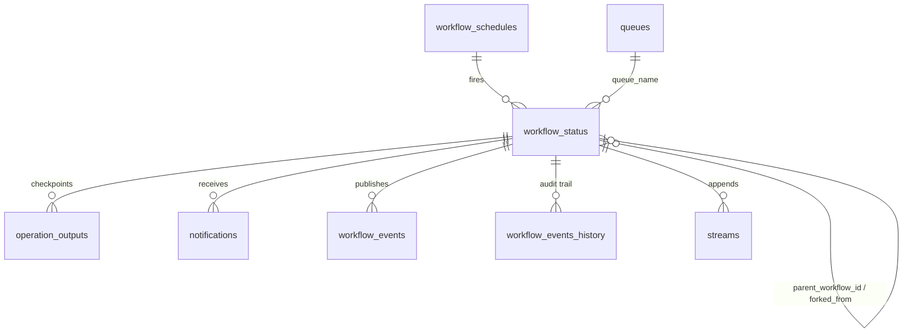
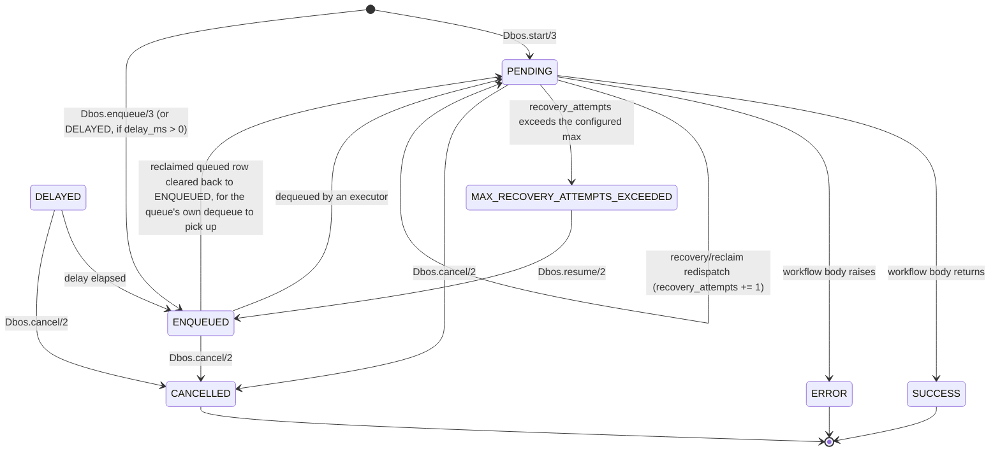

# The system database

Every durable fact `Dbos` knows about a workflow lives in thirteen Postgres tables under one
schema (`dbos` by default). This page is for reading them directly, as an operator would — with
`psql`, a BI tool, an on-call runbook.

## Installing the schema

The schema is installed by an explicit Ecto migration in your application's own migration
sequence. `mix dbos.gen.migration` generates it:

```elixir
defmodule MyApp.Repo.Migrations.AddDbos do
  use Ecto.Migration

  def up, do: Dbos.Migration.up()
  def down, do: Dbos.Migration.down()
end
```

`opts[:prefix]` (default `"dbos"`) names the schema, and must match the `:schema` given to
`Dbos.Supervisor`. `up/1` is idempotent — a guard table records what has been applied. The
statements run inside the host's ordinary migration transaction: `CREATE INDEX CONCURRENTLY` is
stripped, since the tables being indexed are freshly created and empty.

`down/1` drops every table, trigger, and function `up/1` creates, leaving the Postgres schema
object itself in place.

## Entity diagram



## Tables

| Table | Purpose |
|---|---|
| `workflow_status` | One row per workflow: identity, status, timing, queue placement, everything `Dbos.WorkflowStatus` mirrors. |
| `operation_outputs` | One row per completed step, and per built-in durable operation (send, recv, sleep, enqueue, fork, ...). What makes replay possible. |
| `notifications` | The cross-workflow send/recv mailbox. One row per `Dbos.send_message/4` call. |
| `workflow_events` | Latest value per `(workflow_uuid, key)` written by `Dbos.set_event/3` — what `Dbos.get_event/4` reads. |
| `workflow_events_history` | Every event write, in full, so `Dbos.fork/3` can replay which step wrote which event before the fork point. |
| `streams` | Append-only, offset-ordered values per `(workflow_uuid, key)`, behind `Dbos.write_stream/3` and `Dbos.read_stream/3`. |
| `event_dispatch_kv` | Generic key/value store keyed on `(service_name, workflow_fn_name, key)` — scoped to a service and function, shared across every workflow instance of it. |
| `application_versions` | Every distinct `application_version` string this deployment has registered, with a timestamp. |
| `workflow_schedules` | One row per cron-scheduled workflow declaration (`schedule:` on `defworkflow`), plus its `last_fired_at` catch-up floor. |
| `queues` | One row per declared `Dbos.Queue`'s persisted configuration — concurrency, rate limit, partitioning. |
| `executor_leases` | One row per executor: `lease_expires_epoch_ms`, `renewed_at_epoch_ms`, and the node it runs on. The reclaim authority described in `docs/executor-leases.md`. |
| `dbos_migrations` | Version marker for the base schema. |
| `extension_migrations` | Version marker for the tables this engine adds beyond the base schema. |

## `workflow_status` in detail

Keyed on `workflow_uuid`. Selected columns:

| Column | Meaning |
|---|---|
| `workflow_uuid` | The workflow's id (PK). |
| `status` | One of the seven values below. |
| `name` | The registered workflow name recovery dispatches on, independent of module or function. |
| `inputs` / `output` / `error` | Encoded — see "Opaque columns" below. |
| `executor_id` | Which executor currently owns this row. |
| `application_version` | Stamped at start; gates which executor may recover or dequeue this row. |
| `queue_name` / `queue_partition_key` / `priority` | Present only for a queued workflow. |
| `deduplication_id` | The unique-slot key for a queue's dedup/debounce mechanism, `NULL` otherwise. |
| `parent_workflow_id` | Set for a child workflow started from inside another workflow. |
| `forked_from` / `was_forked_from` | `forked_from` on a fork's own row points at its origin; `was_forked_from` is set on the origin once forked. |
| `owner_xid` | A fresh UUID stamped on first insert and never changed; a checkpoint written under a different owner is detected as a mismatch. |
| `created_at` / `updated_at` / `started_at_epoch_ms` / `completed_at` | Millisecond epoch timestamps. |
| `recovery_attempts` | Bumped each time recovery or reclaim redispatches this row; compared against `max_recovery_attempts`. |
| `workflow_timeout_ms` / `workflow_deadline_epoch_ms` | An optional durable deadline, resolved once and persisted. |
| `schedule_name` / `debounce_deadline_epoch_ms` / `is_debounced` | Present only for a scheduled or debounced workflow. |
| `attributes` | Free-form `jsonb`, GIN-indexed and queryable directly. |

## `operation_outputs` in detail

One row per checkpointed durable operation. Primary key `(workflow_uuid, function_id)` — that pair
is the entire replay lookup.

| Column | Meaning |
|---|---|
| `workflow_uuid`, `function_id` | The checkpoint's key. `function_id` is a 0-based counter, incremented once per durable operation in call order. |
| `function_name` | What replay compares against the currently-expected step at this position. A mismatch raises `Dbos.UnexpectedStepError`. Built-in operations use reserved names: `DBOS.getResult`, `DBOS.send`, `DBOS.recv`, `DBOS.sleep`, `DBOS.setEvent`, `DBOS.getEvent`, `DBOS.writeStream`, `DBOS.closeStream`, `DBOS.enqueue`, `DBOS.forkWorkflow`, `DBOS.getStatus`. A user step defaults to `"name/arity"`. |
| `output` / `error` | Encoded; exactly one of the two is set. |
| `child_workflow_id` | Set when this checkpoint is a child-workflow start or a `Dbos.await/2`; `NULL` for a plain step. |
| `started_at_epoch_ms` / `completed_at_epoch_ms` | Wall-clock timing for this one step's execution. |

## Status values and transitions



`SUCCESS`, `ERROR`, `CANCELLED`, and `MAX_RECOVERY_ATTEMPTS_EXCEEDED` are terminal
(`Dbos.Status.terminal?/1`). The only transition out of any of them is `Dbos.resume/2` on the last.

## Notification channels

Three Postgres `LISTEN`/`NOTIFY` channels, each fired by an `AFTER INSERT` trigger on its table.
The payload is always `<id> || '::' || <sub-key>`:

| Channel | Fired by inserting into | Payload |
|---|---|---|
| `dbos_notifications_channel` | `notifications` | `destination_uuid::topic` |
| `dbos_workflow_events_channel` | `workflow_events` | `workflow_uuid::key` |
| `dbos_streams_channel` | `streams` | `workflow_uuid::key` |

A listener splits the payload on `::` to learn which row changed and re-queries for the value; the
payload never carries the value itself.

## Opaque columns

`inputs`, `output`, and `error` on `workflow_status`; `output` and `error` on `operation_outputs`;
`message` on `notifications`; `value` on `workflow_events`, `workflow_events_history`, and
`streams` — each of these holds `:erlang.term_to_binary/1` output, base64-encoded into a `TEXT`
column. Each of those tables also carries a `serialization` column naming the format, `"erl_etf"`.

A SQL client can display these bytes. It cannot filter, compare, index into, or extract structure
from them. Reading a value means decoding it in Elixir or Erlang, which is what
`Dbos.Client.status/2` and `Dbos.Client.steps/2` do for you.

`workflow_status.attributes` is the queryable exception: real `jsonb`, with a GIN index, so
`attributes @> '{"tenant": "acme"}'` works directly.

## Querying from Elixir

`Dbos.Client.list/2` covers most of what an operator query below does, with filters
for status, name, queue, executor, application version, workflow ids and id prefix, parent,
`forked_from`, deduplication id, schedule name, debounce flag, and created/completed/dequeued time
bounds, plus `attributes` containment. `load_input: false` / `load_output: false` skip the large
encoded columns.

## Useful queries

Substitute your configured schema for `dbos` if you changed it.

**What's currently running:**

```sql
SELECT workflow_uuid, name, executor_id, status, created_at
FROM dbos.workflow_status
WHERE status = 'PENDING'
ORDER BY created_at;
```

**Queue depth, awaiting claim:**

```sql
SELECT queue_name, count(*) AS depth
FROM dbos.workflow_status
WHERE status = 'ENQUEUED'
GROUP BY queue_name
ORDER BY depth DESC;
```

**What's failed recently:**

```sql
SELECT workflow_uuid, name, status, updated_at
FROM dbos.workflow_status
WHERE status IN ('ERROR', 'CANCELLED', 'MAX_RECOVERY_ATTEMPTS_EXCEEDED')
ORDER BY updated_at DESC
LIMIT 50;
```

**Which executors hold an expired lease** — the set the orphan sweep reclaims from:

```sql
SELECT ws.executor_id, count(*) AS pending
FROM dbos.workflow_status ws
LEFT JOIN dbos.executor_leases el ON el.executor_id = ws.executor_id
WHERE ws.status = 'PENDING'
  AND (el.executor_id IS NULL
       OR el.lease_expires_epoch_ms <= (EXTRACT(epoch FROM now())::bigint * 1000))
GROUP BY ws.executor_id;
```

**A workflow's checkpointed steps, in order:**

```sql
SELECT function_id, function_name, started_at_epoch_ms, completed_at_epoch_ms
FROM dbos.operation_outputs
WHERE workflow_uuid = 'wf-123'
ORDER BY function_id;
```

**Which application versions have in-flight workflows** — check this before decommissioning a
deployment:

```sql
SELECT application_version, status, count(*)
FROM dbos.workflow_status
WHERE status IN ('PENDING', 'ENQUEUED', 'DELAYED')
GROUP BY application_version, status;
```
