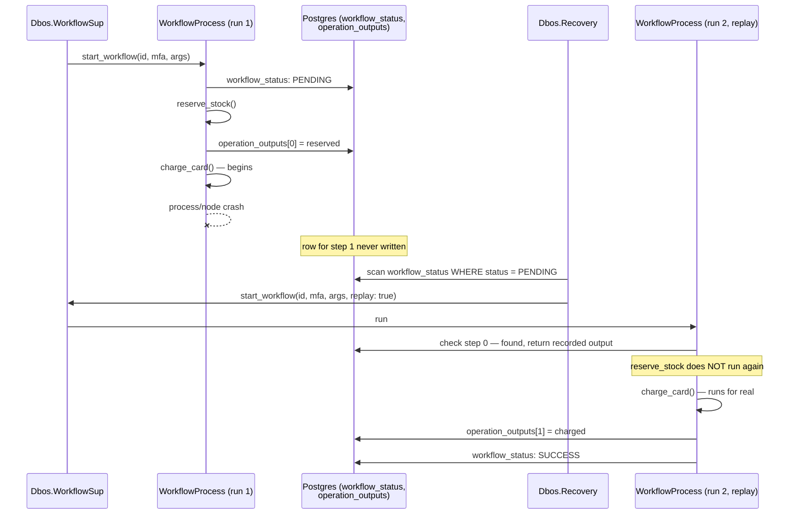
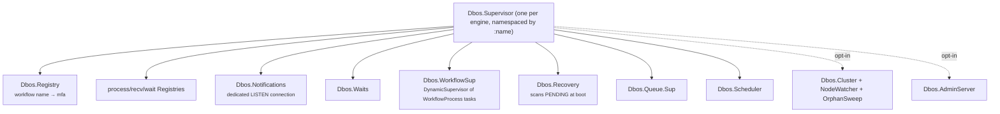

# Architecture

## The core idea in one picture

A workflow is a function. `Dbos` runs it on an ordinary Elixir process, and after every step
records what happened in two Postgres tables. A crash loses the process; it does not lose
those two tables. Recovery starts a fresh process, re-runs the function from the top, and
every step that already has a row in those tables returns its recorded result. It never
runs again.

## The two tables that carry all state

Everything above rests on two rows.

**`workflow_status`** — one row per workflow execution. Holds `status` (`PENDING`,
`ENQUEUED`, `DELAYED`, `SUCCESS`, `ERROR`, `CANCELLED`,
`MAX_RECOVERY_ATTEMPTS_EXCEEDED`), the workflow's `name`, its `inputs` (persisted once, at
start), its final `output`/`error`, `executor_id` (which node owns it right now),
`recovery_attempts`, an optional `parent_workflow_id` for child workflows, and queue-related
columns (`queue_name`, `priority`, `deduplication_id`, `delay_until_epoch_ms`, ...) for
workflows started via `Dbos.enqueue/3`.

**`operation_outputs`** — one row per completed step, keyed by `(workflow_uuid,
function_id)`. Holds the step's `function_name`, its encoded `output` or `error`, and (for a
child workflow start) the `child_workflow_id`. This table is the replay cache: a step's
result, once written here, is never recomputed.

Both tables, plus supporting ones for cross-workflow messaging (`notifications`,
`workflow_events`, `streams`), cron (`workflow_schedules`), and queues (`queues`), live under
one Postgres schema (`dbos` by default) at a fixed migration version. See
`priv/schema/dbos_schema.sql` for the exact DDL.

## The step-id counter, and why replay depends on it

Inside a workflow, `Dbos.Runtime` keeps one counter in the process dictionary: `step_id`,
starting at `-1`. Every durable operation — a step, a transaction, `Dbos.send_message/4`,
`Dbos.enqueue/3`, a child workflow start, and more — calls `next_function_id/0` first, which
increments the counter and returns it. That integer *is* the `function_id` the operation
checkpoints under in `operation_outputs`.

There is no other way an operation finds its row. Replay works by re-running the workflow
body from the top and letting this same counter tick through `0, 1, 2, ...` in the same
order — the *n*th durable operation on this replay checks for a row at `operation_outputs`
position *n*, and if the *n*th operation last time was `reserve_stock` but this time it's
`charge_card`, `Dbos.UnexpectedStepError` is raised, stopping the wrong step's output from
replaying silently. Replay reproducing the exact call sequence is the entire mechanism — it is
why the workflow body has a determinism contract at all (`docs/determinism.md`): a workflow
that calls a different sequence of steps on replay, or computes a step's arguments from
something that changes between runs, breaks the assumption this counter depends on.

## The supervision tree

Every child is started under `Supervisor.init(children, strategy: :one_for_one)`, in the
order shown — the registries and `Dbos.Notifications` come up before `Dbos.WorkflowSup`,
since a workflow process registers itself and may wait on notifications as soon as it
starts; `Dbos.Recovery` comes after `Dbos.WorkflowSup`, since recovery dispatches into it.
Each running workflow is its own `Task` (`Dbos.WorkflowProcess`, `restart: :temporary`)
under `Dbos.WorkflowSup` — one OS-level process failure takes down only that one workflow;
its siblings keep running.

Multiple engines can run in the same BEAM: every process above is namespaced by the
`:name` given to `Dbos.Supervisor`, and `Dbos.Config` is stored per name in
`:persistent_term`, so `Dbos`, `Dbos.Runtime`, and friends never need to be told which
engine they're talking to beyond that name.

## How recovery rebuilds a workflow from checkpoints

`Dbos.Recovery` is a `GenServer` that, in a `handle_continue` right after `start_link`
returns (so boot never blocks on the scan), calls `recover_pending/1`: every `PENDING` row
in `workflow_status` owned by this engine's own `executor_id` gets looked up by `name` in
`Dbos.Registry` and redispatched to `Dbos.WorkflowSup.start_workflow/5` with `replay: true`.
A workflow whose `queue_name` is set is *not* redispatched directly — it's handed back to the
queue instead, so `Dbos.Queue.Runner` claims it in its normal rotation. A name that isn't
registered on this executor is logged and skipped; the rest of the batch still runs.

The redispatched process is an ordinary `Dbos.WorkflowProcess`: it establishes a fresh
`Dbos.Runtime` context (`Dbos.Runtime.with_context/2`) and calls the workflow function again
from the top. Nothing about the function changes between the original run and the replay —
the only difference is that `check_operation_execution` finds a row waiting at every step
position the first run got past, so those steps return instantly. Re-execution is skipped.
The first step position with no row is where real work resumes.

`Dbos.Recovery.reclaim/3` is the same mechanism used for a *different* executor's rows: when
another node in the cluster has gone away (`docs/clustering.md`), a survivor reassigns its
dead `PENDING` rows to its own `executor_id` and recovers them the same way.

## Where the host's Postgres fits

`Dbos` does not run its own database. `Dbos.Config` holds a `{db_module, conn}` pair — either
`{Dbos.DB.Postgrex, pool}` or `{Dbos.DB.Ecto, MyApp.Repo}` — and every checkpoint write goes
through that adapter, onto the same pool your application already uses for its own queries.
A transactional step (`deftransaction`) rides in exactly one `config.db.transaction/3` call,
so the user's own writes and the step's checkpoint commit or roll back together.

There is exactly one exception: a dedicated Postgres connection for `LISTEN`
(`Dbos.Notifications`), separate from the pool, because `LISTEN` occupies a connection for
its entire lifetime and can't be borrowed from a pool meant to be checked in and out. Everything
else — starting workflows, checkpointing steps, querying status, the scheduler's polling,
the queue runner's dequeue — goes through the host's own repo or pool. See
`guides/integrating-dbos.md` for how that connection is derived and what happens if it can't
be established.
