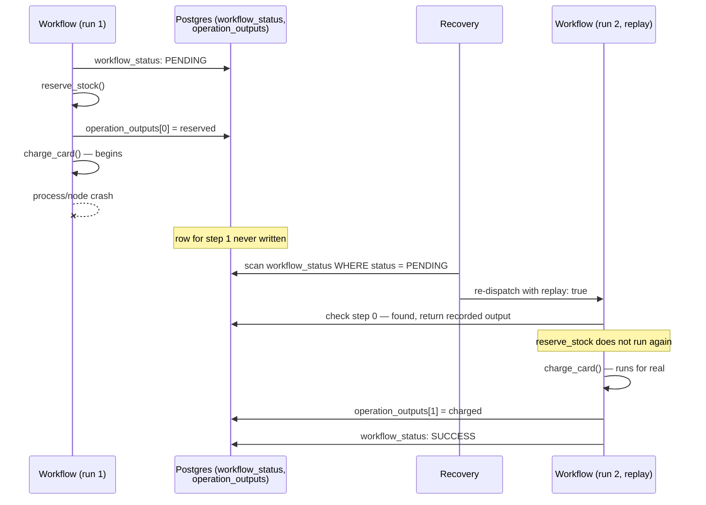

# Architecture

## The core idea

A workflow is a function. `Dbos` runs it on an ordinary Elixir process and, after every step,
records what happened in two Postgres tables. A crash loses the process; the tables survive.
Recovery starts a fresh process, re-runs the function from the top, and every step that
already has a row returns its recorded result without running again.



## The two tables that carry all state

**`workflow_status`** — one row per workflow execution: `status` (`PENDING`, `ENQUEUED`,
`DELAYED`, `SUCCESS`, `ERROR`, `CANCELLED`, `MAX_RECOVERY_ATTEMPTS_EXCEEDED`), the workflow's
`name`, its `inputs` (persisted once, at start), its final `output`/`error`, `executor_id`
(the node that owns it), `recovery_attempts`, an optional `parent_workflow_id`, and queue
columns (`queue_name`, `priority`, `deduplication_id`, `delay_until_epoch_ms`, ...).

**`operation_outputs`** — one row per completed step, keyed by `(workflow_uuid, function_id)`:
the step's `function_name`, its encoded `output` or `error`, and for a child workflow start,
the `child_workflow_id`. This table is the replay cache.

Values in both tables are encoded with `:erlang.term_to_binary/1` and base64-encoded into a
`TEXT` column, under the format name `"erl_etf"`.

Supporting tables cover cross-workflow messaging (`notifications`, `workflow_events`,
`streams`), cron (`workflow_schedules`), and queues (`queues`). All of them live under one
Postgres schema, `dbos` by default.

## The step-id counter

Inside a workflow, a counter starting at `-1` is incremented by every durable operation — a
step, a transaction, `Dbos.send_message/4`, `Dbos.enqueue/3`, a child workflow start. That
integer is the `function_id` the operation checkpoints under.

```
run 1:  reserve_stock → 0    charge_card → 1    notify → 2
replay: reserve_stock → 0    charge_card → 1    notify → 2
             (cached)             (cached)        (runs)
```

An operation finds its row by position alone. So replay depends on the workflow body issuing
the same sequence of durable calls: the *n*th operation looks for the row at position *n*, and
if the recorded row at that position names a different step, `Dbos.UnexpectedStepError` is
raised.

This is the whole reason for the determinism contract. A workflow that branches on the clock,
on `:rand`, or on data that changes between runs can emit a different call sequence and break
the correspondence the counter depends on.

Deliberate changes to a workflow's shape are a different matter, and are handled by
`Dbos.patch/1` and `Dbos.deprecate_patch/1`, which record which branch a given execution took
so an in-flight workflow keeps replaying the code it started on.

## Recovery

Every `PENDING` row owned by this engine's `executor_id` is looked up by workflow `name` and
run again from the top, with its checkpoints in place. The first step position with no row is
where real work resumes.

| Trigger | Scope |
|---|---|
| Engine boot | This executor's own `PENDING` rows |
| A parked wait waking (timer or notification) | One workflow |
| A peer's lease expiring | The dead executor's `PENDING` rows, reassigned to a survivor |

A workflow with a `queue_name` is handed back to its queue, so it re-enters through the
queue's normal concurrency and rate limits. A workflow `name` that
isn't registered on this executor is logged and skipped.

Because recovery finds workflows by `name`, that name is the durable identity of the code: it
must stay stable across deploys, independent of the module and function it lives in.

## Waits do not hold a process

A workflow blocked in `Dbos.sleep/1`, `Dbos.recv_message/3`, or `Dbos.get_event/4` for longer
than `Dbos.Config`'s `park_exit_threshold_ms` gives up its process, leaving a timer and a small
registry entry behind. The deadline or an incoming notification re-dispatches the workflow,
which replays from its checkpoints back to the wait site and continues. A workflow can wait for
days at the cost of a few tens of bytes.

## Where your Postgres fits

`Dbos.Config` holds a `{db_module, conn}` pair — `{Dbos.DB.Postgrex, pool}` or
`{Dbos.DB.Ecto, MyApp.Repo}` — and every checkpoint write goes through it, onto the pool your
application already uses. A `deftransaction` step rides in a single transaction call, so your
own writes and the step's checkpoint commit or roll back together.

One connection sits outside the pool: `LISTEN` occupies a connection for its whole lifetime,
so notifications get a dedicated one.

Multiple engines can run in the same BEAM. Every process is namespaced by the `:name` given to
`Dbos.Supervisor`, and that name is the only thing the API needs to address an engine.

For the determinism rules, the full schema, and clustering, see `docs/`.
