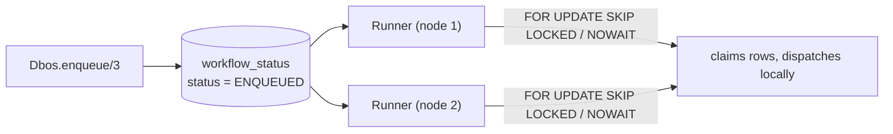

# Queues

A queue is a durable, database-backed work list. Enqueueing a workflow onto a queue inserts a
row and returns immediately — a `Dbos.Queue.Runner` on some engine claims it later and dispatches
it locally. Every runner across every connected BEAM node pulls from the same table, so
concurrency limits, rate limits, and priority are all enforced in Postgres, shared across
every process.



## Declaring a queue

Queues are declared once, on `Dbos.Supervisor`'s `:queues` option, as a list of `Dbos.Queue`
structs:

```elixir
children = [
  MyApp.Repo,
  {Dbos.Supervisor,
   name: Dbos,
   db: {Dbos.DB.Ecto, MyApp.Repo},
   workflows: [MyApp.Checkout],
   queues: [
     Dbos.Queue.new("emails", worker_concurrency: 10),
     Dbos.Queue.new("reports", global_concurrency: 5, rate_limit: %{limit: 100, period_ms: 60_000})
   ]}
]
```

Every declared queue gets its own `Dbos.Queue.Runner`, a polling `GenServer` that ticks on a
backing-off interval (starting at `base_polling_interval_ms`, default `1_000`, capped at
`max_polling_interval_ms`, default `120_000`). A tick that finds contention (another node holding
the row lock) backs off; a quiet tick scales back toward the base interval. Every engine also gets
a runner for a reserved internal queue — the default target `Dbos.resume/2` and `Dbos.fork/3`
re-enqueue onto.

`Dbos.Queue.new/2` validates the combination and raises `Dbos.InvalidQueueOptionError` if
`worker_concurrency` exceeds `global_concurrency`, if `base_polling_interval_ms` isn't positive,
or if `rate_limit`'s `limit`/`period_ms` aren't both positive.

## Enqueueing

```elixir
{:ok, handle} = Dbos.enqueue(MyApp.Reports.generate, [report_id], queue_name: "reports")
{:ok, result} = Dbos.await(handle)
```

`Dbos.enqueue/3` accepts:

| Option | Default | Meaning |
|---|---|---|
| `:queue_name` | — (required) | Which declared queue to insert onto. |
| `:workflow_id` | a fresh UUIDv4 | The workflow's id. |
| `:priority` | `0` | Lower runs first. |
| `:deduplication_id` | `nil` | See Deduplication, below. |
| `:partition_key` | `nil` | See Partitioned queues, below. |
| `:delay_ms` | `nil` | See Delayed start, below. |
| `:application_version` | the engine's own | Which version's workers may claim this row. |

`:deduplication_id` and `:partition_key` are mutually exclusive — passing both raises
`ArgumentError`.

Called from inside a workflow, `enqueue/3` consumes a step id and checkpoints the call under a
`"DBOS.enqueue"` step, so replaying the parent after a crash does not enqueue a second copy.
Called from ordinary code, nothing is checkpointed — there's no parent workflow to checkpoint
into.

## Worker concurrency vs. global concurrency

Two independent limits, enforced at two different scopes:

| Limit | Scope | Enforced by |
|---|---|---|
| `worker_concurrency` | This one BEAM process's runner | Counting this engine's own live `Dbos.WorkflowProcess`es for the queue (`Dbos.WorkflowSup.count_running/3`), in memory. |
| `global_concurrency` | Every engine sharing the database | Counting `PENDING` rows for the queue in Postgres, inside the same transaction that claims new work. |

`worker_concurrency` caps how much of a queue's traffic *this instance* runs at once — useful
for capping local resource usage (say, ten concurrent email sends per node). `global_concurrency`
caps the queue's traffic *everywhere*, across every node pointed at the same database — useful
for a hard ceiling on a downstream dependency that doesn't care which node is calling it. Set
both and the tighter one wins on any given runner: each dequeue pass narrows first by
`worker_concurrency - local_running_count`, then by `global_concurrency - pending_count`, and
takes the smaller.

When `global_concurrency` (or a rate limit) is set, the dequeuing transaction runs at
`:repeatable_read` isolation and locks candidate rows with `FOR UPDATE NOWAIT` (a losing node
simply claims nothing this tick; it never queues up behind the lock). Otherwise it's a plain
`:read_committed` transaction with `FOR UPDATE SKIP LOCKED`, so nodes never block each other.

## Priority

```elixir
Dbos.Queue.new("reports", priority_enabled: true)

Dbos.enqueue(MyApp.Reports.generate, [report_id], queue_name: "reports", priority: 1)
```

Candidates are claimed in `priority ASC, created_at ASC` order: a lower `:priority` number runs
first, and rows with equal priority run in the order they were enqueued. `priority: 0` (the
default) sorts before anything positive — most callers only need to set it on the rows that
should jump the queue.

## Rate limiting

```elixir
Dbos.Queue.new("reports", rate_limit: %{limit: 100, period_ms: 60_000})
```

A rate limit caps how many workflows may *start* on the queue within a sliding window: at most
`limit` workflows whose `started_at_epoch_ms` falls in the last `period_ms` milliseconds. Each
tick counts already-started, non-terminal rows in that window before claiming anything new; if the
count has reached `limit`, the tick claims nothing and tries again next poll.

## Partitioned queues

```elixir
Dbos.Queue.new("tenant_jobs",
  partition_queue: true,
  worker_concurrency: 5,
  rate_limit: %{limit: 50, period_ms: 60_000}
)

Dbos.enqueue(MyApp.Tenant.run_job, [job_id], queue_name: "tenant_jobs", partition_key: tenant_id)
```

A partitioned queue runs one independent copy of every flow-control check per distinct
`:partition_key` value seen on it. **This includes the rate limit** — each partition gets its own
`limit`-per-`period_ms` allowance, held independently of every other partition. This is
deliberate: it gives each tenant (or
customer, or region — whatever the partition key represents) a fair, isolated slice of the
queue's throughput. One noisy tenant enqueueing thousands of jobs cannot starve another tenant's
rate limit or concurrency slot, because every check the runner makes is scoped to
`queue_name = ... AND queue_partition_key = ...`.

Each poll tick discovers live partitions with `SELECT DISTINCT queue_partition_key ... WHERE
status = 'ENQUEUED'` and runs the dequeue-and-dispatch step once per partition found.

### Capping total throughput across all partitions

Per-partition fairness is exactly what makes a *global* cap awkward on a single partitioned
queue — there's no one place a queue-wide rate limit or concurrency count is computed, only
per-partition ones. The documented pattern is two queues: a partitioned queue that hands out each
tenant's fair share, and a plain (non-partitioned) queue underneath it with the real global cap.
A workflow enqueued on the first only fans out onto the second and waits.

```elixir
defmodule MyApp.TenantJobs do
  use Dbos

  defworkflow route_job(tenant_id, job_id), name: "route_job" do
    {:ok, handle} =
      Dbos.enqueue(&do_job/2, [tenant_id, job_id], queue_name: "global_jobs")

    case Dbos.await(handle) do
      {:ok, result} -> result
      {:error, exception} -> raise exception
    end
  end

  defworkflow do_job(tenant_id, job_id), name: "do_job" do
    MyApp.Jobs.run(tenant_id, job_id)
  end
end
```

```elixir
queues: [
  Dbos.Queue.new("tenant_jobs",
    partition_queue: true,
    rate_limit: %{limit: 50, period_ms: 60_000}
  ),
  Dbos.Queue.new("global_jobs", global_concurrency: 20, rate_limit: %{limit: 200, period_ms: 60_000})
]
```

```elixir
Dbos.enqueue(&MyApp.TenantJobs.route_job/2, [tenant_id, job_id],
  queue_name: "tenant_jobs",
  partition_key: tenant_id
)
```

Each tenant gets up to 50 jobs/minute of their own on `tenant_jobs`; `route_job` picks each one up
under that per-tenant allowance, then re-enqueues the real work onto `global_jobs`, which caps the
combined total across every tenant at 20 concurrent / 200 per minute. `route_job` blocks on
`Dbos.await/2` until `do_job` finishes, so its own concurrency slot on `tenant_jobs` is held for
the job's full duration — sized `tenant_jobs`' `worker_concurrency`/`global_concurrency`
accordingly if you don't want a tenant's slots consumed by workflows that are just waiting.

## Delayed start

```elixir
Dbos.enqueue(&MyApp.Reminders.send/1, [user_id], queue_name: "reminders", delay_ms: 3_600_000)
```

A `:delay_ms` value inserts the row as `DELAYED`, holding it back from `ENQUEUED` until the
delay elapses. Every runner's poll tick
starts by sweeping every `DELAYED` row globally (`Dbos.SystemDb.transition_delayed_workflows/1`)
and promoting the ones whose delay has elapsed to `ENQUEUED`, so it becomes a normal dequeue
candidate on the very next pass — on whichever engine's runner ticks first.

## Deduplication

```elixir
Dbos.enqueue(&MyApp.Reports.generate/1, [report_id],
  queue_name: "reports",
  deduplication_id: "report-#{report_id}"
)
```

`:deduplication_id` reserves a single slot per `(queue_name, deduplication_id)` pair. A second
enqueue attempt with the same pair, while the first is still in the queue or running, raises
`Dbos.QueueDeduplicatedError` (carrying the id of whichever workflow already holds the slot).
No duplicate row is inserted.

## Debouncing

Deduplication rejects a repeat; debouncing instead collapses a burst of repeats into one delayed
workflow, pushing its start time out with every additional call — the classic "wait until the
user stops typing" pattern.

```elixir
config = Dbos.config()

{:ok, workflow_id} =
  Dbos.Debouncer.debounce(config, "reindex_document", [doc_id],
    queue_name: "reindex",
    debounce_key: "doc-#{doc_id}",
    period_ms: 2_000,
    deadline_ms: 30_000
  )
```

Each call either starts a fresh `DELAYED` workflow keyed by `:debounce_key`, or "bounces" one
still waiting out its delay: replacing its inputs with this call's `args` and pushing
`delay_until_epoch_ms` forward by `:period_ms` from now. `:deadline_ms`, if given, is fixed at the
first call and caps how far later bounces can push the delay — the workflow fires no later than
`deadline_ms` after the first call, no matter how often it keeps bouncing. Every bounce collapses
onto the same `workflow_id`; the returned id is stable across the whole burst. Raises
`Dbos.QueueDeduplicatedError` if the key is currently held by a plain (non-debounced)
`deduplication_id` enqueue, or by a debounced workflow under a different name.

`Dbos.Debouncer.debounce/4` is a lower-level entry point than `Dbos.enqueue/3`: it takes a
`Dbos.Config` directly (`Dbos.config/0` outside a workflow) and the workflow's registered name as
a plain string; a `defworkflow` capture isn't accepted here — there is currently no
`Dbos.debounce` convenience wrapper alongside `Dbos.enqueue/3`.
