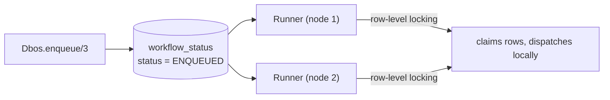

# Queues

A queue is a durable, database-backed work list. Enqueueing a workflow inserts a row and returns
immediately; a queue runner on some engine claims it later and dispatches it locally. Every
runner across every node pulls from the same table, so concurrency limits, rate limits, and
priority are enforced in Postgres, shared across every process.



## Declaring a queue

Queues are declared once, on `Dbos.Supervisor`'s `:queues` option:

```elixir
children = [
  MyApp.Repo,
  {Dbos.Supervisor,
   name: Dbos,
   db: {Dbos.DB.Ecto, MyApp.Repo},
   otp_app: :my_app,
   queues: [
     Dbos.Queue.new("emails", worker_concurrency: 10),
     Dbos.Queue.new("reports", global_concurrency: 5, rate_limit: %{limit: 100, period_ms: 60_000})
   ]}
]
```

`Dbos.Queue.new/2` options:

| Option | Default | Meaning |
|---|---|---|
| `:worker_concurrency` | `nil` | Cap on workflows this engine runs at once for the queue. |
| `:global_concurrency` | `nil` | Cap across every engine sharing the database. |
| `:rate_limit` | `nil` | `%{limit: pos_integer, period_ms: pos_integer}`. |
| `:partition_queue` | `false` | See Partitioned queues, below. |
| `:base_polling_interval_ms` | `1_000` | Starting poll interval for this queue's runner. |

`Dbos.Queue.new/2` raises `Dbos.InvalidQueueOptionError` when `worker_concurrency` exceeds
`global_concurrency`, when `base_polling_interval_ms` is not positive, when `rate_limit`'s `limit`
and `period_ms` are not both positive, or when the name is the reserved internal one.

Each declared queue gets its own polling runner. A tick that hits lock contention backs the
interval off (up to 120s); a quiet tick scales it back toward the base interval. Every engine also
runs a reserved internal queue — the default target `Dbos.resume/2`, `Dbos.retry/2` and
`Dbos.fork/3` re-enqueue onto.

## Enqueueing

A `queue_name:` on a workflow call puts it on that queue:

```elixir
{:ok, handle} = MyApp.Reports.generate(report_id, queue_name: "reports")
{:ok, result} = Dbos.await(handle)
```

`Dbos.enqueue/3` does the same by registered workflow name or `&Mod.fun/n` capture, for code with
no workflow function to call:

```elixir
{:ok, handle} = Dbos.enqueue(&MyApp.Reports.generate/1, [report_id], queue_name: "reports")
```

Both accept:

| Option | Default | Meaning |
|---|---|---|
| `:queue_name` | — (required) | Which declared queue to insert onto. |
| `:workflow_id` | a fresh UUIDv4 | The workflow's id. |
| `:engine` | `Dbos` | Which engine to enqueue on. |
| `:priority` | `0` | Lower runs first. |
| `:deduplication_id` | `nil` | See Deduplication, below. |
| `:partition_key` | `nil` | See Partitioned queues, below. |
| `:delay_ms` | `nil` | See Delayed start, below. |
| `:timeout_ms` | `nil` | Durable deadline for the workflow once it starts. |
| `:application_version` | the engine's own | Which version's workers may claim this row. |

`:deduplication_id` and `:partition_key` are mutually exclusive, and an unrecognised key is
refused; both raise `Dbos.InvalidWorkflowOptionError`.

Inside a workflow the two call forms differ in what they wait for. A workflow call with a
`queue_name:` queues the child and blocks for its result. `Dbos.enqueue/3` returns a handle as
soon as the row is inserted, leaving the parent free to carry on and `Dbos.await/2` it later.
Either way the enqueue consumes a step id and checkpoints, so replaying the parent after a crash
queues nothing further.

## Worker concurrency vs. global concurrency

| Limit | Scope | Counted from |
|---|---|---|
| `worker_concurrency` | This one engine's runner | This engine's live workflow processes for the queue, in memory. |
| `global_concurrency` | Every engine sharing the database | `PENDING` rows for the queue, inside the claiming transaction. |

`worker_concurrency` caps local resource usage (say, ten concurrent email sends per node).
`global_concurrency` puts a hard ceiling on a downstream dependency that does not care which node
is calling it. Set both and each dequeue pass narrows first by
`worker_concurrency - local_running_count`, then by `global_concurrency - pending_count`, taking
the smaller.

## Priority

```elixir
MyApp.Reports.generate(report_id, queue_name: "reports", priority: 1)
```

Candidates are claimed in `priority ASC, created_at ASC` order: a lower `:priority` number runs
first, and rows of equal priority run in enqueue order. `priority: 0` (the default) sorts ahead of
anything positive, so most callers set `:priority` only on the rows that should jump the queue.

## Rate limiting

```elixir
Dbos.Queue.new("reports", rate_limit: %{limit: 100, period_ms: 60_000})
```

A rate limit caps how many workflows may *start* on the queue within a sliding window: at most
`limit` workflows started in the last `period_ms` milliseconds. A tick that finds the window full
claims nothing and tries again on the next poll.

## Partitioned queues

```elixir
Dbos.Queue.new("tenant_jobs",
  partition_queue: true,
  worker_concurrency: 5,
  rate_limit: %{limit: 50, period_ms: 60_000}
)

MyApp.Tenant.run_job(job_id, queue_name: "tenant_jobs", partition_key: tenant_id)
```

A partitioned queue runs one independent copy of every flow-control check per distinct
`:partition_key` value. **This includes the rate limit** — each partition gets its own
`limit`-per-`period_ms` allowance. That is deliberate: it gives each tenant (or customer, or
region) a fair, isolated slice of throughput, so one noisy tenant enqueueing thousands of jobs
leaves every other tenant's allowance and concurrency slots intact.

Each poll tick discovers the partitions that currently have `ENQUEUED` rows and runs the
dequeue-and-dispatch pass once per partition.

### Capping total throughput across all partitions

Per-partition fairness means a single partitioned queue has no queue-wide limit to compute. The
pattern for a global cap is two queues: a partitioned queue that hands out each tenant's fair
share, and a plain queue underneath it carrying the global cap. A workflow on the first fans out
onto the second and waits.

```elixir
queues: [
  Dbos.Queue.new("tenant_jobs", partition_queue: true, rate_limit: %{limit: 50, period_ms: 60_000}),
  Dbos.Queue.new("global_jobs", global_concurrency: 20, rate_limit: %{limit: 200, period_ms: 60_000})
]
```

```elixir
defmodule MyApp.TenantJobs do
  use Dbos

  defworkflow route_job(tenant_id, job_id), name: "route_job" do
    do_job(tenant_id, job_id, queue_name: "global_jobs")
  end

  defworkflow do_job(tenant_id, job_id), name: "do_job" do
    MyApp.Jobs.run(tenant_id, job_id)
  end
end
```

```elixir
MyApp.TenantJobs.route_job(tenant_id, job_id,
  queue_name: "tenant_jobs",
  partition_key: tenant_id
)
```

Each tenant gets up to 50 jobs/minute of their own on `tenant_jobs`; `global_jobs` caps the
combined total at 20 concurrent / 200 per minute. `route_job` blocks for the job's full duration,
holding its slot on `tenant_jobs` the whole time — size `tenant_jobs`' concurrency with that in
mind.

## Delayed start

```elixir
MyApp.Reminders.send(user_id, queue_name: "reminders", delay_ms: 3_600_000)
```

`:delay_ms` inserts the row as `DELAYED`. Every runner's poll tick begins by promoting every
`DELAYED` row whose delay has elapsed to `ENQUEUED`, on whichever engine ticks first, making it a
normal dequeue candidate on the next pass.

## Deduplication

```elixir
MyApp.Reports.generate(report_id,
  queue_name: "reports",
  deduplication_id: "report-#{report_id}"
)
```

`:deduplication_id` reserves a single slot per `(queue_name, deduplication_id)` pair. A second
enqueue with the same pair, while the first is still queued or running, raises
`Dbos.QueueDeduplicatedError` carrying the id of the workflow holding the slot. No row is
inserted.

## Debouncing

Debouncing collapses a burst of repeats into one delayed workflow, pushing its start time out with
every additional call — the "wait until the user stops typing" pattern.

```elixir
{:ok, handle} =
  Dbos.debounce(&MyApp.Search.reindex_document/1, [doc_id],
    queue_name: "reindex",
    debounce_key: "doc-#{doc_id}",
    period_ms: 2_000,
    deadline_ms: 30_000
  )
```

| Option | Meaning |
|---|---|
| `:queue_name` | Required. The queue the delayed workflow sits on. |
| `:debounce_key` | Required. Identifies the burst being collapsed. |
| `:period_ms` | Required. How far each call pushes the start time out from now. |
| `:deadline_ms` | Optional. Ceiling on the total delay, fixed at the first call. |
| `:engine` | Default `Dbos`. |

Each call either starts a fresh `DELAYED` workflow keyed by `:debounce_key`, or bounces one still
waiting out its delay — replacing its inputs with this call's `args` and pushing its wake time
forward by `:period_ms`. With `:deadline_ms` set, the workflow fires within that long of the first
call however often it bounces. Every bounce returns a handle to the same workflow id, stable
across the whole burst.

`Dbos.QueueDeduplicatedError` is raised when the key is currently held by a plain
`:deduplication_id` enqueue, or by a debounced workflow under a different name.

Called from inside a workflow, `debounce/3` consumes a step id and checkpoints the call.
