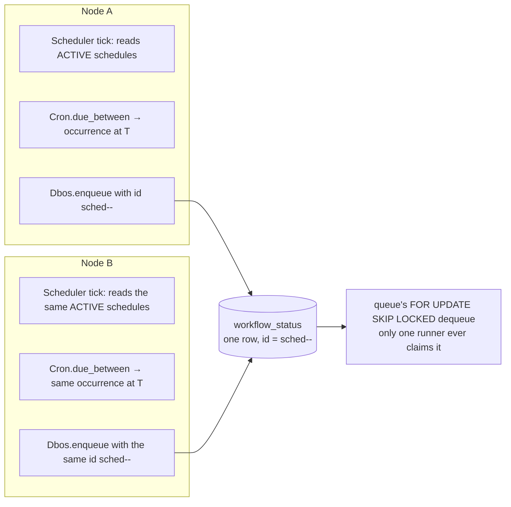

# Scheduled Workflows

A scheduled workflow fires automatically on a cron schedule, exactly once per occurrence, no
matter how many engine instances are sharing the database.

## Declaring one

```elixir
defmodule MyApp.Reports do
  use Dbos

  defworkflow nightly_summary(scheduled_time_ms, _context), name: "nightly_summary",
    schedule: "0 0 3 * * *" do
    MyApp.Reports.build_summary_for(scheduled_time_ms)
  end
end
```

`schedule:` on `defworkflow` registers the workflow as cron-scheduled. It takes either a bare cron
string, or a keyword list for more control:

```elixir
defworkflow monthly_invoice(scheduled_time_ms, context), name: "monthly_invoice",
  schedule: [
    cron: "0 0 6 1 * *",
    name: "monthly_invoice_schedule",
    automatic_backfill: true,
    queue_name: "invoicing",
    context: %{currency: :usd}
  ] do
  MyApp.Invoicing.run(scheduled_time_ms, context)
end
```

| Key | Default | Meaning |
|---|---|---|
| `cron:` | — (required in keyword form) | The cron expression. |
| `name:` | the workflow's own `name:` | This schedule's own identity, if it needs to differ from the workflow name. |
| `automatic_backfill:` | `false` | See Catch-up, below. |
| `timezone:` | `nil` (UTC) | Only `nil`/`"UTC"` is supported; anything else raises `Dbos.NotSupportedError`. |
| `queue_name:` | the reserved internal queue | Which queue fired occurrences are enqueued onto. |
| `context:` | `nil` | A compile-time literal passed as the workflow's second argument on every fire. |

A scheduled workflow's function must take exactly two arguments: `(scheduled_time_ms, context)`.
`scheduled_time_ms` is the fired occurrence's scheduled epoch-ms time — not "now" — so a workflow
that needs to know which window it's covering (a report for "yesterday," an invoice for "last
month") computes that from `scheduled_time_ms`, making a backfilled run deterministic and
identical to the original one that would have fired on time. `context` is whatever static value
was declared alongside the schedule.

Registering the module on `Dbos.Supervisor`'s `:workflows` list is what makes the schedule active
— `Module.__dbos_schedules__/0`, generated by `defworkflow`, feeds `Dbos.Scheduler` at boot:

```elixir
{Dbos.Supervisor,
 name: Dbos,
 db: {Dbos.DB.Ecto, MyApp.Repo},
 workflows: [MyApp.Reports]}
```

## The cron grammar

Six space-separated fields — one more than the traditional five-field cron, with an added
leading seconds field:

```
second minute hour day-of-month month day-of-week
```

| Field | Range | Notes |
|---|---|---|
| second | `0-59` | |
| minute | `0-59` | |
| hour | `0-23` | |
| day-of-month | `1-31` | `?` is accepted as an alias for `*`. |
| month | `1-12` | Or `JAN`–`DEC`, case-insensitive. |
| day-of-week | `0-6` | `0` = Sunday. Or `SUN`–`SAT`, case-insensitive. `?` is accepted as an alias for `*`. |

Each field accepts `*` (any value), a single integer, a comma-separated list (`1,15,30`), a range
(`9-17`), or a stepped range/wildcard (`0-30/5`, `*/15`).

```elixir
"0 */15 * * * *"     # every 15 minutes, on the minute
"0 0 9 * * MON-FRI"   # 9am UTC, weekdays
"0 30 2 1 * ?"        # 2:30am UTC on the 1st of every month
```

**Day-of-month and day-of-week are OR'd, not AND'd, when both are restricted.** If both fields are
something other than a wildcard, a candidate date matches if *either* one matches — not only if
both do. `"0 0 0 15 * MON"` fires on the 15th of every month *and* every Monday, not only on a
Monday that happens to fall on the 15th. Leave one of the two as `*` (or `?`) to constrain on only
the other.

### `@` descriptors

| Descriptor | Equivalent |
|---|---|
| `@yearly` / `@annually` | `0 0 0 1 1 *` |
| `@monthly` | `0 0 0 1 * *` |
| `@weekly` | `0 0 0 * * 0` |
| `@daily` / `@midnight` | `0 0 0 * * *` |
| `@hourly` | `0 0 * * * *` |

### `@every <duration>`

```elixir
schedule: "@every 90s"
schedule: "@every 1h30m"
```

A fixed interval measured from the previous fire time, rather than a wall-clock calendar
schedule — units `ns`, `us`/`µs`, `ms`, `s`, `m`, `h` combine (`1h30m`).

## Exactly-once firing across nodes



Every engine's `Dbos.Scheduler` polls independently (`scheduler_poll_interval_ms`, a
`Dbos.Supervisor` option, default `30_000`), reading the full `ACTIVE` set fresh from
`workflow_schedules` on every tick — so several engines sharing one database, or a schedule
declared by only one of them, all converge on the same set without coordinating directly.

Each due occurrence is enqueued under a deterministic id: `"sched-<schedule_name>-<scheduled_time_ms>"`.
Two engines independently computing the same occurrence both attempt to insert the same
`workflow_uuid`, so they collapse onto one `workflow_status` row (the second insert is a no-op
against the first). That id collision is what prevents two *rows*; it's the queue's own `FOR
UPDATE SKIP LOCKED` dequeue — the same mechanism any other queued workflow uses — that guarantees
the workflow *body* actually runs exactly once, since only one runner's transaction can claim that
one row.

## Catch-up after downtime

```elixir
schedule: [cron: "0 0 3 * * *", automatic_backfill: false]  # default
schedule: [cron: "0 0 3 * * *", automatic_backfill: true]
```

- **`automatic_backfill: false`** (the default): a schedule's starting floor is the moment *this
  process* first sees it reconcile — any ticks that would have fired while no engine was running
  at all are silently skipped. Safe default for anything where a missed run is fine to just drop
  (a "clean up old rows" job, say).
- **`automatic_backfill: true`**: the starting floor instead comes from the schedule's persisted
  `last_fired_at` in `workflow_schedules`. Every occurrence missed since the last time *any* engine
  fired it — whether from downtime, a deploy, or the schedule being newly added — is enqueued on
  the next reconcile, each under its own deterministic `sched-<name>-<time>` id, and each receiving
  its own correct `scheduled_time_ms` so the backfilled runs are indistinguishable from ones that
  fired on time.

Use `automatic_backfill: true` for anything where every occurrence matters (an invoice for every
month, no matter what) and `false` (or omit it) where only "still running regularly" matters.

## Deactivating

```elixir
Dbos.Scheduler.deactivate(Dbos)
```

Also reachable as `GET /deactivate` on the admin server. Stops this engine from firing new
occurrences; already-enqueued work already in the queue is unaffected and runs to completion.
