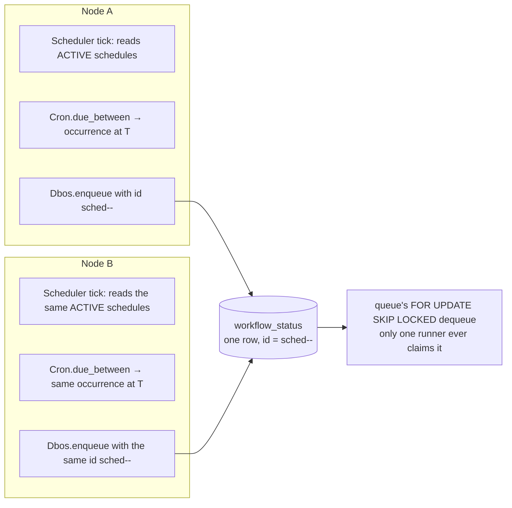

# Scheduled Workflows

A scheduled workflow fires automatically on a cron schedule, exactly once per occurrence, no
matter how many engine instances are sharing the database.

## Declaring one

```elixir
defmodule MyApp.Reports do
  use Dbos

  defworkflow nightly_summary(scheduled_time_ms, _context), name: "nightly_summary",
    schedule: "0 0 3 * * *" do
    MyApp.Reports.build_summary_for(scheduled_time_ms)
  end
end
```

`schedule:` on `defworkflow` registers the workflow as cron-scheduled. It takes either a bare cron
string, or a keyword list for more control:

```elixir
defworkflow monthly_invoice(scheduled_time_ms, context), name: "monthly_invoice",
  schedule: [
    cron: "0 0 6 1 * *",
    name: "monthly_invoice_schedule",
    automatic_backfill: true,
    queue_name: "invoicing",
    context: %{currency: :usd}
  ] do
  MyApp.Invoicing.run(scheduled_time_ms, context)
end
```

| Key | Default | Meaning |
|---|---|---|
| `cron:` | — (required in keyword form) | The cron expression. |
| `name:` | the workflow's own `name:` | This schedule's own identity, if it needs to differ from the workflow name. |
| `automatic_backfill:` | `false` | See Catch-up, below. |
| `timezone:` | `nil` (UTC) | Only `nil`/`"UTC"` is supported; anything else raises `Dbos.NotSupportedError`. |
| `queue_name:` | the reserved internal queue | Which queue fired occurrences are enqueued onto. |
| `context:` | `nil` | A compile-time literal passed as the workflow's second argument on every fire. |

A scheduled workflow's function must take exactly two arguments: `(scheduled_time_ms, context)`.
`scheduled_time_ms` is the fired occurrence's scheduled epoch-ms time. Compute the window a run
covers from it — a report for "yesterday", an invoice for "last month" — and a backfilled run
produces exactly what the on-time run would have. `context` is the static value declared alongside
the schedule.

The schedule goes active once the engine knows about the module, through `:otp_app` discovery or an
explicit `:workflows` entry:

```elixir
{Dbos.Supervisor,
 name: Dbos,
 db: {Dbos.DB.Ecto, MyApp.Repo},
 otp_app: :my_app}
```

## The cron grammar

Six space-separated fields, leading with seconds:

```
second minute hour day-of-month month day-of-week
```

| Field | Range | Notes |
|---|---|---|
| second | `0-59` | |
| minute | `0-59` | |
| hour | `0-23` | |
| day-of-month | `1-31` | `?` is accepted as an alias for `*`. |
| month | `1-12` | Or `JAN`–`DEC`, case-insensitive. |
| day-of-week | `0-6` | `0` = Sunday. Or `SUN`–`SAT`, case-insensitive. `?` is accepted as an alias for `*`. |

Each field accepts `*` (any value), a single integer, a comma-separated list (`1,15,30`), a range
(`9-17`), or a stepped range/wildcard (`0-30/5`, `*/15`).

```elixir
"0 */15 * * * *"     # every 15 minutes, on the minute
"0 0 9 * * MON-FRI"   # 9am UTC, weekdays
"0 30 2 1 * ?"        # 2:30am UTC on the 1st of every month
```

**Day-of-month and day-of-week are OR'd when both are restricted.** When neither field is a
wildcard, a candidate date matches if *either* matches: `"0 0 0 15 * MON"` fires on the 15th of
every month and on every Monday. Leave one of the two as `*` (or `?`) to constrain only the other.

### `@` descriptors

| Descriptor | Equivalent |
|---|---|
| `@yearly` / `@annually` | `0 0 0 1 1 *` |
| `@monthly` | `0 0 0 1 * *` |
| `@weekly` | `0 0 0 * * 0` |
| `@daily` / `@midnight` | `0 0 0 * * *` |
| `@hourly` | `0 0 * * * *` |

### `@every <duration>`

```elixir
schedule: "@every 90s"
schedule: "@every 1h30m"
```

A fixed interval measured from the previous fire time. Units `ns`, `us`/`µs`, `ms`, `s`, `m`, `h`
combine (`1h30m`).

## Exactly-once firing across nodes



Every engine's `Dbos.Scheduler` polls independently (`scheduler_poll_interval_ms`, a
`Dbos.Supervisor` option, default `30_000`), reading the full `ACTIVE` set fresh from
`workflow_schedules` on every tick, so engines sharing one database converge on the same set
without coordinating directly.

Each due occurrence is enqueued under a deterministic id:
`"sched-<schedule_name>-<scheduled_time_ms>"`. Two engines computing the same occurrence insert the
same `workflow_uuid` and collapse onto one `workflow_status` row. The queue's `FOR UPDATE SKIP
LOCKED` dequeue then guarantees exactly one runner claims that row and runs the body.

## Catch-up after downtime

```elixir
schedule: [cron: "0 0 3 * * *", automatic_backfill: false]  # default
schedule: [cron: "0 0 3 * * *", automatic_backfill: true]
```

- **`automatic_backfill: false`** (the default): the schedule's starting floor is the moment this
  process first reconciles it. Ticks that came due while no engine was running are skipped. Use it
  where dropping a missed run is fine — a "clean up old rows" job.
- **`automatic_backfill: true`**: the floor comes from the schedule's persisted `last_fired_at`.
  Every occurrence missed since any engine last fired it — downtime, a deploy, a newly added
  schedule — is enqueued on the next reconcile, each under its own `sched-<name>-<time>` id and its
  own `scheduled_time_ms`. Use it where every occurrence matters, like a monthly invoice.

## Deactivating

```elixir
Dbos.Scheduler.deactivate(Dbos)
```

Also reachable as `GET /deactivate` on the admin server. Stops this engine from firing new
occurrences; work already in the queue runs to completion.
