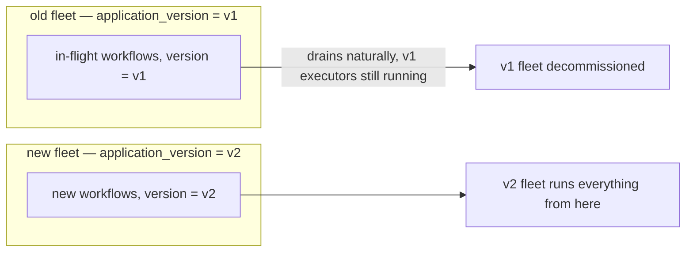
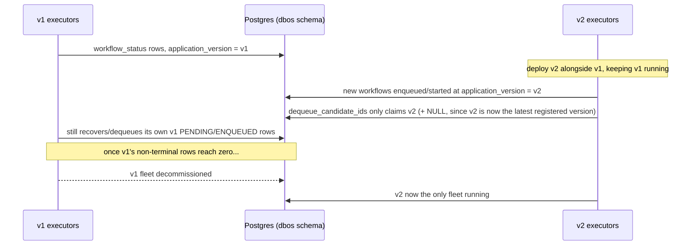

# Upgrading Workflows

Some workflows outlive a single deploy: they're still `PENDING` in Postgres when you ship new
code. Recovery replays such a workflow against whatever code is running *now* — so the new
code has to reproduce the same step sequence the old code would have produced, or replay
mismatches the checkpoints already on disk.

This page is about that gap: what breaks a workflow already in flight, and how to ship a
change without breaking it.

## What counts as a breaking change

Everything here follows from one fact: a checkpoint is keyed on `(workflow_uuid, function_id)`
and records only a step's `function_name` and output — its source code plays no part in that
record. Replay walks the
workflow body from the top, and at each step call it looks up `function_id` (a plain counter,
incremented once per durable operation) and compares the recorded `function_name` against the
one the *current* code is about to run. A mismatch raises `Dbos.UnexpectedStepError`.

| Change | Breaks replay? | Why |
|---|---|---|
| Reordering two steps | Yes | `function_id` 0 now names a different step than what's recorded there. |
| Renaming a step (its `name:`, or the default `"fun/arity"`) | Yes | `Dbos.UnexpectedStepError`: `function_name` recorded ≠ `function_name` expected. |
| Adding or removing a step before an existing one | Yes | Shifts every later step's `function_id` by one. |
| Changing how many step ids a branch allocates (an `if`/`case`/`cond` where the arms call a different number of durable operations) | Yes | The branch actually taken during the original run fixed the id layout; a differently-shaped branch on replay misaligns every id after it. `mix dbos.explain` flags this statically — see `guides/tutorials/workflows.md`. |
| Changing the shape of a struct/map stored as workflow `inputs`, a step's `output`, an event value, or a stream item | Yes, on decode | Everything is encoded as an Erlang term (`docs/interop-migration.md`). A struct's fields are part of that term; adding/removing/renaming a field, or renaming the module, changes what `:erlang.binary_to_term/1` hands back — old rows decode into whatever shape they were written with at the time. |
| Adding a brand new step at the *end* of a workflow, after every step an in-flight instance could already have completed | No, for that instance | Nothing before it shifted. Still a landmine for an instance not yet that far along, unless the new step is unconditionally reached in every remaining path. |
| Changing a step's *body* without touching its name, its position, or how many ids it consumes | No | Replay never re-runs a completed step — only the step's checkpointed name and position matter; today's body plays no part in the match. A step not yet reached picks up the new behavior on its first (only) execution. |

The determinism checker (`Dbos.Determinism`, `docs/determinism.md`) catches nondeterministic
*constructs* at compile time. It does not — cannot — know that this deploy renamed a step
relative to the *previous* deploy. Reasoning about upgrade safety is a separate discipline from
writing a deterministic workflow body in the first place.

## Application version: what it is, how it's computed

Every workflow row carries `application_version` (`workflow_status.application_version`),
stamped at start time from `Dbos.Config.application_version`. Recovery and dequeue both use it
to decide which running executor is allowed to pick a row back up.

Resolved once, at `Dbos.Supervisor` boot (`lib/dbos/supervisor.ex`):

1. the `:application_version` option, if given;
2. else the `DBOS__APPVERSION` environment variable;
3. else `Dbos.Version.compute/1` — a SHA-256 digest over the compiled BEAM code of every
   registered workflow module, excluding the `Docs` chunk, order-independent.

```elixir
{Dbos.Supervisor,
 name: Dbos,
 application_version: System.get_env("RELEASE_VSN") || System.get_env("GIT_SHA"),
 ...}
```

Pin it explicitly for a real release (`guides/integrating-dbos.md`'s "Executor identity and
application version for a release" covers this in more depth). The computed fallback changes
whenever any registered workflow module's compiled code changes — including changes that don't
affect step layout at all, like a doc comment — so relying on it across a real deploy makes
"which version is this" harder to reason about than pinning a value you control (a git SHA, a
release tag).

## Where the version actually gates behavior

Two places in `Dbos.SystemDb`:

- **Dequeue** (`dequeue_candidate_ids/4`): an executor whose `application_version` is the most
  recently registered one (`application_versions.version_timestamp` descending) also claims
  `ENQUEUED` rows with a `NULL` application_version; every other executor claims only rows whose
  version exactly matches its own. `NULL` means "no version was set when this was enqueued" —
  practically, rows enqueued by very old client code, or through the SQL-only `enqueue_workflow`
  function.
- **Reclaim** (`reclaim_pending_workflows/3`): a dead executor's non-queued `PENDING` rows are
  only reassigned to a live executor whose `application_version` matches the row's, when
  `config.application_version` is set at all. An executor running a different version leaves
  those rows alone.

The practical effect: bump the version, and an in-flight workflow started under the old version
sits `PENDING`/`ENQUEUED` until an executor whose own `application_version` matches shows up to
run it — or forever, if none ever does.

## Three ways to ship a change safely

### 1. Bump `application_version` for the breaking change

The straightforward option. Old in-flight workflows keep waiting for an executor stamped with
their own version; that executor is the *old* deployment, kept running until every one of its
workflows drains.



Deploy sequence:

1. Ship the new code as `v2`, running *alongside* the still-running `v1` fleet — don't stop `v1`
   yet.
2. New workflows start under `v2` (whichever version is `config.application_version` for
   whoever calls `Dbos.start/3`/`Dbos.enqueue/3`).
3. `v1` executors keep recovering and dequeuing their own in-flight `v1` workflows, since
   `application_version` still matches.
4. Once `dbos.workflow_status` has no more non-terminal rows at `application_version = 'v1'`
   (`SELECT count(*) FROM dbos.workflow_status WHERE application_version = 'v1' AND status IN
   ('PENDING','ENQUEUED','DELAYED')` — see `docs/system-database.md` for more queries like this),
   decommission the `v1` fleet.

Cost: you run two versions of the application at once for as long as the oldest in-flight
workflow takes to finish. For a workflow that can run for days, that's a real operational
commitment worth planning for explicitly.

### 2. A new workflow name

Give the changed workflow a new `name:` (and, if convenient, a new function), leaving the
existing one in place. Old in-flight instances keep dispatching under the old name
to the old body — as long as it's still registered — while every new invocation goes through
the new name to the new body.

```elixir
defworkflow process_order(order_id, amount), name: "process_order" do
  # old behavior — keep this body untouched, and keep it registered,
  # until every "process_order" instance in flight has finished
end

defworkflow process_order_v2(order_id, amount), name: "process_order_v2" do
  # new behavior
end
```

Callers that mint new workflows switch to `process_order_v2`. Nothing about the old workflow's
step sequence changes underneath any in-flight instance, because its code doesn't change at all.
Retire the old function (and stop registering its name) only once nothing is left running
against it.

This works for any breaking change, including ones outside a version boundary, and it doesn't
require running two application versions in parallel — both bodies live in the same deployed
code at once. The tradeoff is code you have to keep around (and keep registered) until the old
name's last instance finishes, and a naming scheme (`_v2`, `_v3`, ...) to track.

### 3. A patch

`Dbos.patch/1` inserts new steps into a workflow body without a version bump or a new name. It
returns a boolean: `true` for code taking the new path, `false` for an existing instance whose
replay must skip it and keep its original step sequence intact.

```elixir
defworkflow process_order(order_id), name: "process_order" do
  charge = charge_card(order_id)

  if Dbos.patch("fraud-check") do
    fraud_check(order_id)
  end

  ship(order_id)
end
```

| Call site | What `Dbos.patch("fraud-check")` returns | Why |
|---|---|---|
| A brand-new workflow | `true` | Nothing recorded at this point yet — takes the new path. |
| An in-flight instance that has not reached this point yet | `true` | Same as above: no checkpoint there yet on replay. |
| An in-flight instance that already ran past this point under the old code | `false` | A checkpoint already sits at this point, recorded under some other name (whatever step ran here originally) — the patch is not taken, and no id is consumed, so every step after it keeps its original `function_id`. |
| A replay of an instance that already took this same patch | `true` | The checkpoint recorded here is the patch's own marker — replay reproduces the same decision. |

A patch check is the "changing how many ids a branch allocates" case flagged in the table above,
turned into a deliberate, checkpointed design: it allocates differently across old and new
instances on purpose, recording that difference itself so replay stays consistent.
`mix dbos.explain` recognizes `if Dbos.patch(...) do ... end` as its own case: a conditional
0-or-1-id allocation, reported as such.

A patch consumes an id only on the `true` path (both the "new workflow" and "replaying an
already-patched instance" rows above); the `false` path consumes none, which is what keeps an
old instance's downstream `function_id`s aligned with what it already recorded. Calling
`Dbos.patch/1` outside a workflow, or from inside a step or a `Dbos.transaction/3` body, raises
`Dbos.PatchInStepError` — there is no meaningful decision to make without a workflow body's own
step-id counter and checkpoint history to consult.

#### Retiring the patch

Once every pre-patch instance has drained, the `if Dbos.patch(...)` check comes out and the new
step runs unconditionally. Instances that *did* record the patch marker may still be in flight,
though, and each of those has a `"DBOS.patch-fraud-check"` checkpoint sitting at an id the new
code no longer allocates. `Dbos.deprecate_patch/1` stands in that spot and absorbs it:

```elixir
defworkflow process_order(order_id), name: "process_order" do
  charge = charge_card(order_id)

  Dbos.deprecate_patch("fraud-check")
  fraud_check(order_id)

  ship(order_id)
end
```

| Call site | What `Dbos.deprecate_patch("fraud-check")` does | Why |
|---|---|---|
| A replay of an instance that took the patch | Consumes one id | The marker is recorded here — swallowing its id keeps every later step aligned with what that instance wrote. |
| A brand-new workflow | Consumes no id, writes nothing | The marker is retired; the next step takes the id it used to hold. |
| An in-flight instance that ran past this point without the marker | Consumes no id | Its recorded sequence is left exactly as it is. |

Once every marker-carrying instance has drained too, the `Dbos.deprecate_patch/1` line can be
deleted — the new code becomes the only code.

## Summary: what happens to an in-flight workflow

| Strategy | In-flight workflow's fate | Cost |
|---|---|---|
| Bump `application_version` | Waits for an executor still running the old version; runs to completion unchanged | Run two fleets until the old one drains |
| New workflow name | Keeps dispatching to the untouched old body under the old name | Keep the old function/name registered until it drains |
| Patch (`Dbos.patch/1`) | Sees `false` at the patch point and skips the new step, keeping its recorded sequence | Keep the `if Dbos.patch(...)` check in the code until every pre-patch instance drains |
| Do nothing, change the workflow in place | `Dbos.UnexpectedStepError` on its next step, or a decode failure on a changed struct shape, the first time it replays | Broken workflow, manual recovery |

## Rolling upgrade, end to end



The one subtlety in that last dequeue step: "latest version" is whichever
`application_versions.version_name` has the newest `version_timestamp`
(`get_latest_application_version/1`) — set the moment an executor of that version first starts
(`create_application_version/2`, called once per boot, `ON CONFLICT DO NOTHING`). Start your
`v2` fleet before you need it to start claiming `NULL`-version rows, and don't start a stray
instance of an even newer, unintended version by accident — whichever version boots first wins
"latest" and starts absorbing `NULL` rows meant for nobody in particular.
