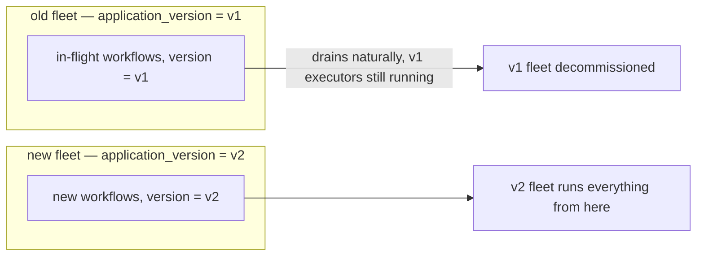

# Upgrading Workflows

Some workflows outlive a single deploy: they're still `PENDING` in Postgres when you ship new
code. Recovery replays such a workflow against whatever code is running *now*, so the new code has
to reproduce the same step sequence the old code produced. This page covers what breaks a workflow
already in flight, and how to ship a change safely.

## What counts as a breaking change

A checkpoint is keyed on `(workflow_uuid, function_id)` and records the step's `function_name` and
output. Replay walks the workflow body from the top, and at each step call compares the recorded
`function_name` at that `function_id` against the one the current code is about to run. A mismatch
raises `Dbos.UnexpectedStepError`.

| Change | Breaks replay? | Why |
|---|---|---|
| Reordering two steps | Yes | `function_id` 0 now names a different step than what's recorded there. |
| Renaming a step (its `name:`, or the default `"fun/arity"`) | Yes | `function_name` recorded ≠ `function_name` expected. |
| Adding or removing a step before an existing one | Yes | Shifts every later step's `function_id` by one. |
| Changing how many step ids a branch allocates (an `if`/`case`/`cond` whose arms call a different number of durable operations) | Yes | The branch taken during the original run fixed the id layout; a differently-shaped branch on replay misaligns every id after it. `mix dbos.explain` flags this statically. |
| Changing the shape of a struct/map stored as workflow `inputs`, a step's `output`, an event value, or a stream item | Yes, on decode | Values are stored as Erlang terms, so a struct's fields and module name are part of the stored value. Rows written before the change decode back into the shape they were written with. |
| Adding a brand new step at the *end*, after every step an in-flight instance could already have completed | No, for that instance | Nothing before it shifted. Still a landmine for an instance not yet that far along, unless the new step is unconditionally reached on every remaining path. |
| Changing a step's *body*, leaving its name, position, and id count alone | No | Replay never re-runs a completed step; only the checkpointed name and position are matched. A step not yet reached picks up the new behavior on its first execution. |

The compile-time determinism checker catches nondeterministic *constructs*. It has no knowledge of
the previous deploy, so upgrade safety stays your call.

## Application version

Every workflow row carries `application_version`, stamped at start time. Recovery and dequeue use
it to decide which running executor may pick a row back up. It resolves once, at `Dbos.Supervisor`
boot:

1. the `:application_version` option, if given;
2. else the `DBOS__APPVERSION` environment variable;
3. else a computed digest over every registered workflow module's compiled code (each module's
   `module_info(:md5)`), order-independent.

```elixir
{Dbos.Supervisor,
 name: Dbos,
 application_version: System.get_env("RELEASE_VSN") || System.get_env("GIT_SHA"),
 ...}
```

Pin it explicitly for a real release. The computed fallback moves whenever any registered workflow
module's compiled code changes, which makes "which version is this" hard to answer from the outside;
a git SHA or release tag you control answers it directly.

Two places gate on it:

- **Dequeue** — an executor whose `application_version` is the most recently registered one also
  claims `ENQUEUED` rows with a `NULL` application_version; every other executor claims only rows
  matching its own version exactly. "Most recently registered" is whichever version has the newest
  `application_versions.version_timestamp`, written the first time an executor of that version
  boots.
- **Reclaim** — a dead executor's non-queued `PENDING` rows are reassigned only to a live executor
  whose `application_version` matches the row's, whenever `config.application_version` is set.

So bumping the version leaves an in-flight workflow started under the old version `PENDING`/
`ENQUEUED` until an executor stamped with its version shows up to run it.

## Three ways to ship a change safely

### 1. Bump `application_version`

Old in-flight workflows keep waiting for an executor stamped with their own version — the *old*
deployment, kept running until its workflows drain.



1. Ship the new code as `v2`, running *alongside* the still-running `v1` fleet.
2. New workflows start under `v2`; `v1` executors keep recovering and dequeuing their own
   in-flight `v1` workflows.
3. Decommission `v1` once it has no non-terminal rows left:

```sql
SELECT count(*) FROM dbos.workflow_status
WHERE application_version = 'v1' AND status IN ('PENDING','ENQUEUED','DELAYED');
```

Cost: two versions of the application run at once for as long as the oldest in-flight workflow
takes to finish. Start the `v2` fleet deliberately — whichever version boots first becomes "latest"
and starts absorbing `NULL`-version rows.

### 2. A new workflow name

Give the changed workflow a new `name:`, leaving the existing one in place and registered. Old
in-flight instances keep dispatching under the old name to the old body; every new invocation goes
through the new name.

```elixir
defworkflow process_order(order_id, amount), name: "process_order" do
  # keep this body untouched and registered until every in-flight instance has finished
end

defworkflow process_order_v2(order_id, amount), name: "process_order_v2" do
  # new behavior
end
```

Both bodies live in one deployed version, so no parallel fleet is needed. The cost is code you keep
around until the old name's last instance drains, plus a naming scheme to track.

### 3. A patch

`Dbos.patch/1` inserts new steps into a workflow body under one version and one name. It returns a
boolean: `true` for code taking the new path, `false` for an existing instance whose replay must
skip it and keep its original step sequence intact.

```elixir
defworkflow process_order(order_id), name: "process_order" do
  charge = charge_card(order_id)

  if Dbos.patch("fraud-check") do
    fraud_check(order_id)
  end

  ship(order_id)
end
```

| Call site | `Dbos.patch("fraud-check")` returns | Why |
|---|---|---|
| A brand-new workflow | `true` | Nothing recorded at this id yet; writes the marker and takes the new path. |
| An in-flight instance that has not reached this point | `true` | Same: no checkpoint there yet. |
| An in-flight instance that already ran past this point | `false` | A checkpoint under some other name already sits at this id. No id is consumed, so every later step keeps its original `function_id`. |
| A replay of an instance that already took this patch | `true` | The checkpoint here is the patch's own marker; replay reproduces the decision. |

The `true` path consumes an id; the `false` path consumes none, which is what keeps an old
instance's downstream `function_id`s aligned with what it recorded. `mix dbos.explain` recognizes
`if Dbos.patch(...) do ... end` as a conditional 0-or-1-id allocation.

`Dbos.patch/1` must be called from a workflow body: outside a workflow it raises
`Dbos.NotInWorkflowError`, and from inside a step or a `Dbos.transaction/3` body,
`Dbos.PatchInStepError`.

#### Retiring the patch

Once every pre-patch instance has drained, the `if Dbos.patch(...)` check comes out and the new
step runs unconditionally. Instances that *did* record the marker may still be in flight, each with
a `"DBOS.patch-fraud-check"` checkpoint at an id the new code no longer allocates.
`Dbos.deprecate_patch/1` stands in that spot and absorbs it:

```elixir
defworkflow process_order(order_id), name: "process_order" do
  charge = charge_card(order_id)

  Dbos.deprecate_patch("fraud-check")
  fraud_check(order_id)

  ship(order_id)
end
```

| Call site | `Dbos.deprecate_patch("fraud-check")` | Why |
|---|---|---|
| A replay of an instance that took the patch | Consumes one id | Swallowing the marker's id keeps every later step aligned with what that instance wrote. |
| A brand-new workflow | Consumes no id, writes nothing | The marker is retired; the next step takes the id it held. |
| An in-flight instance that ran past this point without the marker | Consumes no id | Its recorded sequence is left as it is. |

It obeys the same call-site rule as `Dbos.patch/1`. Once every marker-carrying instance has drained,
delete the line.

## Summary

| Strategy | In-flight workflow's fate | Cost |
|---|---|---|
| Bump `application_version` | Waits for an executor still running the old version; runs to completion unchanged | Run two fleets until the old one drains |
| New workflow name | Keeps dispatching to the untouched old body under the old name | Keep the old function and name registered until it drains |
| Patch (`Dbos.patch/1`) | Sees `false` at the patch point and skips the new step, keeping its recorded sequence | Keep the check in the code until every pre-patch instance drains |
| Change the workflow in place | `Dbos.UnexpectedStepError` on its next step, or a decode failure on a changed struct shape | Broken workflow, manual recovery |
