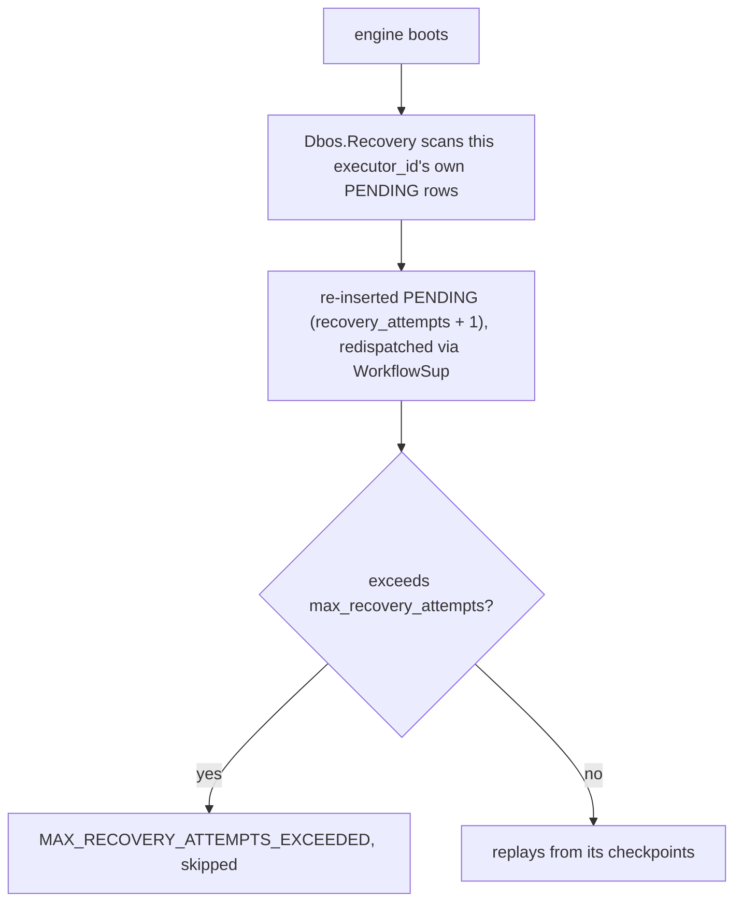

# Workflow Management

Every workflow run is a row in `workflow_status`, plus one row per checkpointed step in
`operation_outputs`. This tutorial covers reading that state back — listing workflows, inspecting
a single one's steps — and acting on it: cancel, resume, retry, fork, and garbage collection. It also
covers what happens when a node dies mid-workflow, and the admin HTTP API that exposes all of this
over the wire.

## Listing and inspecting workflows

```elixir
{:ok, workflows} =
  Dbos.Client.list(Dbos.config(),
    status: :error,
    name: "process_order",
    limit: 50,
    sort: :desc
  )
```

`Dbos.Client.list/2` orders by `created_at` and takes:

| Option | Matches |
|---|---|
| `:status`, `:name`, `:queue_name`, `:executor_id`, `:application_version` | Equality. Each also accepts a list, matching any of them. |
| `:workflow_ids`, `:authenticated_user`, `:forked_from`, `:parent_workflow_id`, `:deduplication_id`, `:schedule_name` | Equality, or a list. |
| `:is_debounced` | `true`/`false` — rows created by `Dbos.debounce/3`. |
| `:has_parent` | `true`/`false` — whether `parent_workflow_id` is set. |
| `:workflow_id_prefix` | `workflow_uuid LIKE "<prefix>%"`. |
| `:attributes` | A JSON containment match (`@>`) against the row's `attributes`. |
| `:created_after`/`:created_before` | Epoch-ms bounds on `created_at`. |
| `:completed_after`/`:completed_before` | Epoch-ms bounds on `completed_at`. |
| `:dequeued_after`/`:dequeued_before` | Epoch-ms bounds on `started_at_epoch_ms`. |
| `:load_input`, `:load_output` | Default `true`; set `false` to return `nil` in place of the column, skipping the decode of a large payload. |
| `:limit`, `:offset`, `:sort` | Paging; `:sort` is `:desc` (default) or `:asc`. |
| `:queues_only` | `true` restricts to rows with a queue. |

```elixir
{:ok, status} = Dbos.status(workflow_id)
{:ok, steps} = Dbos.Client.steps(Dbos.config(), workflow_id)
{:ok, output_or_error} = Dbos.result(workflow_id)
```

- `Dbos.status/2` fetches one workflow's full `%Dbos.WorkflowStatus{}` row. Called from inside a
  workflow, it consumes a step id and checkpoints under `"DBOS.getStatus"`, so a replay returns the
  status as recorded then, frozen regardless of whatever it has changed to since.
- `Dbos.Client.steps/2` returns every checkpointed step (`%Dbos.StepInfo{}`), ordered by
  `function_id` — each one's name, timing, and recorded output or error.
- `Dbos.result/2` returns `{:ok, output}`, `{:error, exception}`, or `:pending`.

## Cancel

```elixir
:ok = Dbos.cancel(workflow_id)
```

Durably marks the workflow `CANCELLED` — a no-op if it's already `SUCCESS`/`ERROR`/`CANCELLED`. If
the workflow has a live process on this engine, it's woken immediately, so a blocked
`recv_message`/`get_event`/`sleep` is interrupted right away, skipping the rest of its timeout. A
workflow actively running plain steps stops cooperatively at its next step boundary.

`opts[:cancel_children]` (default `false`) cancels the whole descendant tree in the same
transaction. Called from inside a workflow, `cancel/2` consumes a step id and checkpoints under
`"DBOS.cancelWorkflow"`.

## Resume

```elixir
:ok = Dbos.resume(workflow_id)
```

Resumes from the workflow's last checkpoint: clears its queue assignment and deadline, then
re-enqueues it (onto `opts[:queue_name]`, default the reserved internal queue). Every step already
recorded is skipped on replay; execution continues from the first uncheckpointed step. Resuming a
workflow that already finished (`SUCCESS`/`ERROR`) is a silent no-op. Called from inside a
workflow, this consumes a step id and checkpoints under `"DBOS.resumeWorkflow"`.

## Retry

```elixir
:ok = Dbos.retry(workflow_id)
```

Puts a failed workflow back to work, from its last checkpoint. `Dbos.retry/2` acts on the three
terminal statuses a run can fail into — `ERROR`, `CANCELLED`, `MAX_RECOVERY_ATTEMPTS_EXCEEDED`
(`Dbos.Status.retryable/0`) — clearing the recorded error, resetting `recovery_attempts` to `0`,
clearing the queue assignment and deadline, and re-enqueueing onto `opts[:queue_name]` (default
the internal queue).

| Status | `Dbos.retry/2` |
|---|---|
| `ERROR`, `CANCELLED`, `MAX_RECOVERY_ATTEMPTS_EXCEEDED` | Re-enqueued from its last checkpoint. |
| `SUCCESS` | Untouched. Callers have already read the output, so the run is final; `Dbos.fork/3` re-runs that work under a new id. |
| `PENDING`, `ENQUEUED`, `DELAYED` | Untouched — the workflow is already live. |

Leaving the live statuses alone is what makes two operators clicking retry at the same moment
safe: the first call moves the row to `ENQUEUED`, and the second finds a status it does not act
on, so the workflow starts once.

A step whose *own* failure was checkpointed re-raises that recorded failure on replay, so a
workflow that failed inside a step fails the same way again. `Dbos.fork/3` from that step id is
the route that re-runs the step itself.

Called from inside a workflow, `retry/2` consumes a step id and checkpoints under
`"DBOS.retryWorkflow"`.

## Fork

```elixir
{:ok, new_handle} = Dbos.fork(workflow_id, 3)
```

`Dbos.fork/3` (`workflow_id`, `start_step`, `opts`) copies a workflow's history up to (not
including) `start_step` into a brand-new workflow id, and enqueues that new workflow to re-run
starting at `start_step` — useful for retrying from partway through after fixing a bug, without
redoing the steps that already succeeded, and without disturbing the original run.

What gets copied, all with `function_id < start_step`:

- `operation_outputs` — every checkpointed step's recorded output/error
- `workflow_events_history` and the derived latest-value `workflow_events` snapshot
- `streams`

The original workflow is marked `was_forked_from = TRUE` and keeps running (or stays finished) as
it was; the fork's own row records `forked_from`, which `Dbos.Client.list/2` filters on.
`opts`: `:new_workflow_id` (default a fresh UUID), `:queue_name`
(default the internal queue), `:application_version` (overrides the copied one — handy when
forking to retry under a fixed version of the code). Raises `Dbos.NonExistentWorkflowError` if
`workflow_id` doesn't exist.

Called from inside a workflow, `fork/3` consumes a step id and checkpoints under
`"DBOS.forkWorkflow"`, so replaying the caller doesn't fork a second time.

## Garbage collection

```elixir
Dbos.SystemDb.garbage_collect_workflows(Dbos.config(),
  cutoff_epoch_timestamp_ms: System.os_time(:millisecond) - :timer.hours(24) * 30,
  rows_threshold: 100_000
)
```

Deletes `workflow_status` rows (cascading to their steps, events, and streams) older than an
effective cutoff. Both options may be given together: `:cutoff_epoch_timestamp_ms` is an absolute
age cutoff, `:rows_threshold` instead keeps at least that many of the newest rows regardless of
age — the effective cutoff used is whichever of the two is more permissive (the max of both).
`PENDING`/`ENQUEUED`/`DELAYED` rows are never deleted, no matter how old. Returns the number of
rows deleted. Reachable over HTTP via `POST /dbos-garbage-collect` on the admin server.

## Recovery model

Each engine instance has an `executor_id` (from `Dbos.Supervisor`'s `:executor_id` option, the
`DBOS__VMID` env var, or the BEAM node name, in that order) and an `application_version` (from
`:application_version`, `DBOS__APPVERSION`, or a hash of every registered workflow module's code).
A workflow row records which executor started it and which application version it's running.



- **On boot**, every engine recovers its own `PENDING` workflows —
  `Dbos.Recovery.recover_pending/1` reclaims this executor's own id, resuming work after a restart
  of the same node.
- **Redispatch** re-inserts the row as `PENDING` with `recovery_attempts` incremented (bounded by
  `:max_recovery_attempts`, default `3` — a workflow that keeps failing to even start is marked
  `MAX_RECOVERY_ATTEMPTS_EXCEEDED` and left alone), then replays the body from the top, with every
  already-recorded step returning its checkpointed result.
- **A queued `PENDING` workflow** — one still assigned to a queue — is handed back to its queue
  (cleared to `ENQUEUED`) for the queue's own dequeue logic to pick back up.
- **An unregistered workflow name** (this executor doesn't have that workflow's module loaded) is
  logged and skipped; the rest of the recovery batch continues.

### Reclaiming a dead executor's work

`Dbos.Recovery.reclaim/3` (`engine_name`, `dead_executor_ids`, `opts`) reassigns every `PENDING`
row owned by any of `dead_executor_ids` to this engine's own `executor_id` and redispatches it,
returning the workflow ids it acted on. Every survivor may call it concurrently for the same dead
ids safely: the reassigning `UPDATE` is the serialization point, so whichever call loses the race
redispatches nothing. `opts[:batch_size]` bounds how many non-queued rows one call claims
(unbounded by default).

Deciding *who* is dead is the lease sweep's job, or an operator's, via the admin server's recovery
route.

## The admin HTTP API

Opt in via `Dbos.Supervisor`'s `:admin_server` option (default port `3001`):

```elixir
{Dbos.Supervisor,
 name: Dbos,
 db: {Dbos.DB.Ecto, MyApp.Repo},
 admin_server: [enabled: true, port: 3001]}
```

| Method | Path | Does |
|---|---|---|
| `GET` | `/dbos-healthz` | Liveness check. |
| `POST` | `/dbos-workflow-recovery` | Body is a JSON array of dead executor ids; calls `Dbos.Recovery.reclaim/3` and returns the reclaimed workflow ids. |
| `GET` | `/deactivate` | Stops the scheduler firing new cron ticks (`Dbos.Scheduler.deactivate/1`); already-enqueued work is unaffected. |
| `GET` | `/dbos-workflow-queues-metadata` | Lists every declared queue's configuration, including the internal queue. |
| `POST` | `/dbos-garbage-collect` | Body may set `cutoff_epoch_timestamp_ms`/`rows_threshold`; returns `{"deleted": n}`. |
| `POST` | `/dbos-global-timeout` | Body sets `cutoff_epoch_timestamp_ms`; cancels every workflow created before it. |
| `POST` | `/queues`, `/workflows` | List workflows (`/queues` restricts to queued ones). The body accepts the filters above under their JSON names — `workflow_name` for `:name`, `sort_desc` (a boolean) for `:sort`, the rest verbatim. `created_after`/`created_before` are available only through `Dbos.Client.list/2`. |
| `GET` | `/workflows/{id}` | One workflow's status. |
| `GET` | `/workflows/{id}/steps` | One workflow's checkpointed steps. |
| `POST` | `/workflows/{id}/cancel` | `Dbos.cancel/2`. |
| `POST` | `/workflows/{id}/resume` | `Dbos.resume/2`. |
| `POST` | `/workflows/{id}/retry` | `Dbos.retry/2`. |
| `POST` | `/workflows/{id}/fork` | Body may set `start_step` (default `0`), `new_workflow_id`, `application_version`. |

The server is a bare `:gen_tcp` listener, one process per connection, with no keep-alive.

### Values render through `inspect/1`

`workflow_status.inputs`/`.output`/`.error` and each step's `output`/`.error` are Erlang terms, and
the admin API renders them through `inspect/1` as a readable string. A workflow that took
`%{currency: :usd, amount: 4200}` as input shows up over the API as
`"input": "[%{currency: :usd, amount: 4200}]"`. Every other field renders as itself.
