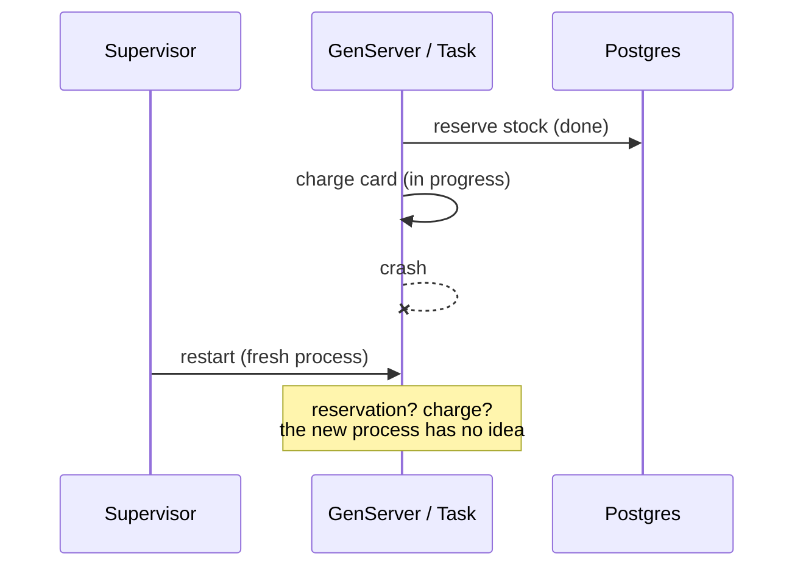

# Why Durable Execution

## The problem

A supervisor restarts a crashed process. The crashed process's **work** stays lost.

`reserve_stock` may have committed. `charge_card` may have charged the customer and crashed
before recording it, or crashed before charging at all. The restarted process begins at
`init/1` with none of that history, so its only safe move is to start over — which works
only if every step is idempotent.

**Durable execution stores the history.** Every step a workflow takes is written to Postgres
before the next one starts. A crash of any kind leaves a record of how far the
workflow got. Recovery replays from that record, and a completed step "replays"
by returning what it recorded.

## What you get

- A multi-step business process (reserve → charge → ship → notify) that survives a crash at
  any point between steps.
- Checkpoints in the same Postgres database your application already uses: one connection
  pool, one backup story.
- Workflows that wait for arbitrarily long. A long wait
  gives up its process and is re-dispatched when it wakes.
- Child workflows, queues (concurrency limits, rate limits, priority, delay, partitioning),
  and cron scheduling, all built on the same checkpoint mechanism.

## What it costs

| Cost | Detail |
|---|---|
| Latency per step | Every step is a round trip to Postgres. |
| Determinism contract | Workflow bodies must replay identically: clock reads, `:rand`, bare `receive`, and `Task.async` belong inside steps. |
| Operational surface | A schema to migrate and keep in sync, a supervision tree, and workflow names that stay stable across deploys. |

## When *not* to reach for it

- A single database write that a Postgres transaction already makes atomic.
- Fire-and-forget work with no delivery guarantee to uphold, where a dropped run needs no
  recovery.
- A process whose state is disposable, where a supervisor restart already fixes things by
  starting fresh.
- High-throughput, low-latency hot paths, which usually buy their throughput by giving up
  durability or by batching work — neither of which a per-step checkpoint does.

## How this compares

| | Recovers from | Does **not** recover | Where the state lives |
|---|---|---|---|
| **Supervisor restart** | A crashed process, structurally | Work the process was doing — in-progress steps, partial side effects | Nowhere; the new process starts from `init/1` |
| **GenServer state** | Nothing | The state itself, on crash or node death | The process's own heap |
| **Plain retries** | A single failed call, retried in place | Multi-step processes; a crash between steps loses position | Nowhere durable |
| **Oban** | A failed *job*, requeued and retried from the top | Partial progress within one job | The queue's table; the job body re-runs in full |
| **Oban Pro workflows** | A failed *job* inside a DAG of jobs; dependents wait, and a job's recorded output is available to them | Partial progress within one job | The queue's table, plus each job's recorded output |
| **Temporal** | A crashed workflow, resumed from an event history | — | A separate Temporal cluster you operate |
| **`Dbos`** | A crashed workflow, resumed from its last completed step | — | `dbos.workflow_status` / `dbos.operation_outputs`, in your own Postgres |

Oban guarantees a job *runs*, retried as a whole, and Oban Pro's workflows extend that to a
multi-step process: jobs declare dependencies on each other, a job can record its output for
its dependents to read, and the DAG survives restarts because it lives in the jobs table. The
unit of execution and retry stays a whole job, and the process is described by wiring jobs
together. `Dbos` makes the unit a step inside one ordinary function body — the card will not be
charged twice because the charge step recorded that it happened, and control flow stays as
`if`, `case`, and local calls.

Temporal offers the same programming model with a much larger operational footprint: its own
server cluster, its own storage, and its own deployment lifecycle. `Dbos` runs inside your
BEAM nodes and stores its state in the database you already run.
