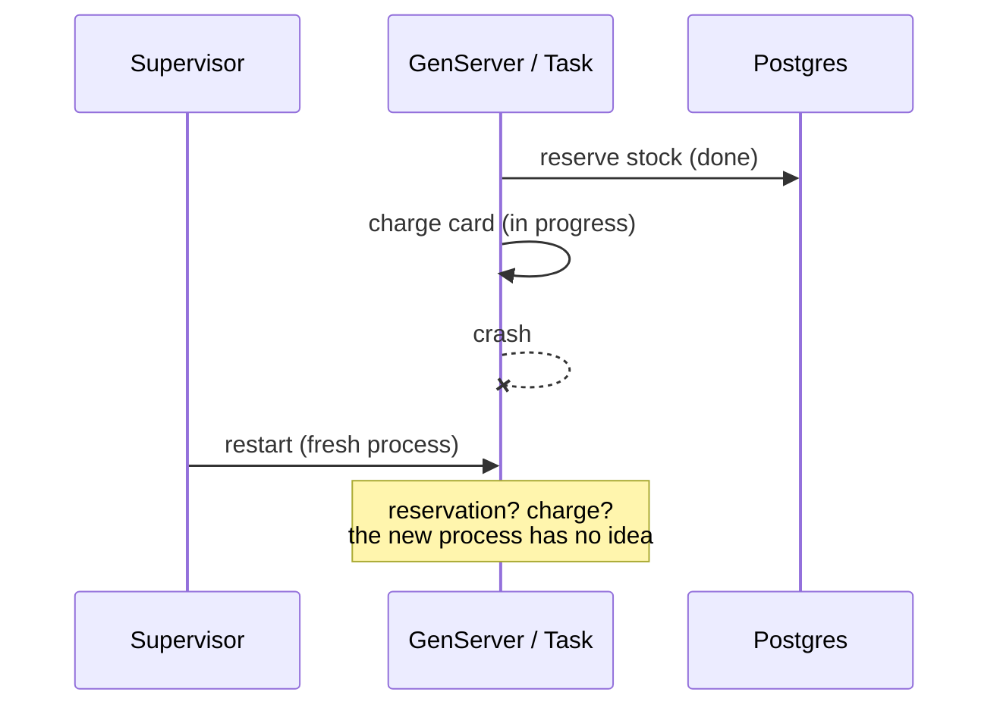

# Why Durable Execution

## The problem, precisely

A supervisor restarts a crashed process. The crashed process's **work** stays lost.

`reserve_stock` may have already committed. `charge_card` may have charged the customer and
crashed before recording it, or crashed before charging at all. The restarted process starts
from `init/1` with none of that history — it does not know which of those things happened,
so it cannot safely pick up where the old one left off. It can only start over, and starting
over is only safe if every step is either idempotent or excluded from replay entirely, and
somebody remembered to make sure of that by hand.

**Durable execution stores that history.** Every step a workflow takes is written to Postgres
before the next one starts. A crash of any kind — process, node, deploy — leaves a record of
exactly how far the workflow got. Recovery does not guess; it replays from that record, and
"replays" a completed step by returning what it recorded. The step never runs again.

## What you get

- A multi-step business process (reserve → charge → ship → notify) that survives a crash at
  any point between steps, without a queue, a saga library, or a separate worker fleet.
- Steps checkpoint into the same Postgres database your application already uses — one
  connection pool, one backup story, one thing to operate.
- A workflow can wait — for a message, an event, a timer — for arbitrarily long without
  holding a process or a connection open the whole time; see `guides/architecture.md` for how
  parking works.
- Child workflows, queues (concurrency limits, rate limits, priority, delay, partitioning),
  and cron scheduling all build on the same checkpoint mechanism.

## What it costs

- Every step is a round trip to Postgres. A workflow doing thousands of trivial, sub-millisecond
  operations pays a checkpoint write for each one — durability trades throughput for
  recoverability.
- Workflow bodies must be deterministic on replay: no direct reads of the clock, no `:rand`, no
  bare `receive`, no `Task.async` — anything that can produce a different value on a second run
  has to happen inside a step. This is a real constraint on how you write the code; see
  `docs/determinism.md` for the full list and why it matters.
- It is one more moving part: a schema to migrate and keep in sync, a supervision tree to
  reason about, workflow names that must stay stable across deploys.

## When *not* to reach for it

- A single database write that Postgres's own transaction already makes atomic. You don't
  need a workflow to insert one row.
- Fire-and-forget background work where "it didn't run" is an acceptable, shruggable outcome —
  a plain `Task.start/1` or a simple job queue is less machinery.
- A process whose state is disposable — a cache warmer, a connection, anything a supervisor
  restart already fixes on its own by starting fresh.
- Very high-throughput, low-latency hot paths where a database round trip per step is the
  wrong trade-off.

## How this compares to what OTP already gives you

| | Recovers from | Does **not** recover | Where the state lives |
|---|---|---|---|
| **Supervisor restart** | A crashed process, structurally (a new process starts) | Any work the process was doing — in-progress steps, partial side effects | Nowhere; the new process starts from `init/1` |
| **GenServer state** | Nothing — state lives in one process's memory | The state itself, on crash or node death | The process's own heap |
| **Plain retries** (`with_retry`, `Retry` libs) | A single failed call, retried in place | Multi-step processes; a crash between steps loses position | Nowhere durable |
| **Oban** (or similar job queue) | A failed *job*, requeued and retried from the top | Partial progress *within* one job — no built-in step checkpointing | The queue's own table; the job body re-runs in full on retry |
| **`Dbos`** | A crashed workflow, resumed from its last completed step | — | `dbos.workflow_status` / `dbos.operation_outputs`, in your own Postgres |

The distinction that matters: Oban guarantees a job *runs*, retried as a whole if it fails.
`Dbos` guarantees a workflow's *steps* individually survive a crash — the difference between
"the job will run again from scratch" and "the card will not be charged twice because the
charge step already recorded that it happened." They're not mutually exclusive: a Dbos
workflow queue (`Dbos.Queue`) plays a similar role to Oban's queue for *starting* work, while
`defstep`/`deftransaction` add per-operation durability underneath it.

## The one sentence

A supervisor restart recovers a **process**; `Dbos` recovers the **work** the process was
partway through.
